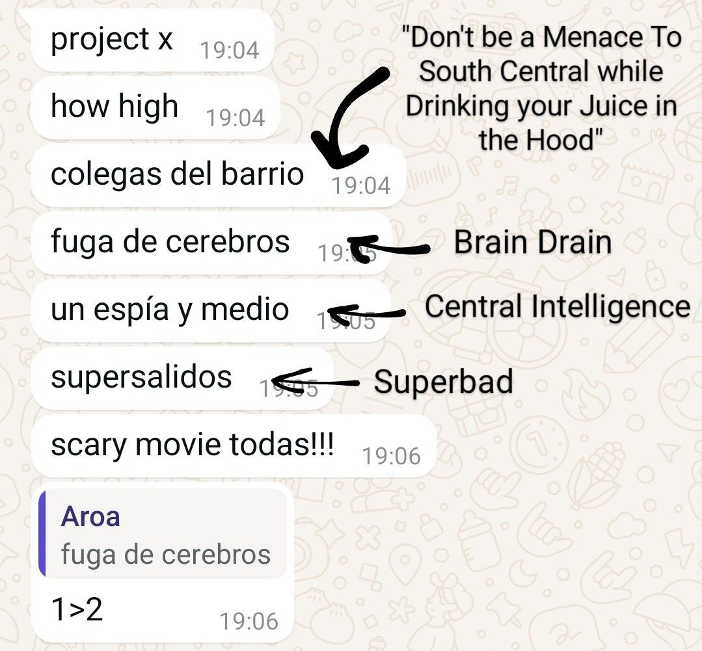

TODO: escaneos 3d y mejor calidad de las 2d


  {{ super }}
  
  


[[toc]]

<i><strong>Note</strong>: This article contains themes that may be emotionally distressing for some readers. If you feel you may be vulnerable to such content, please consider your wellbeing before proceeding.</i>

Today, I want to convince you of how awesome my sister, Aroa, was. We lost her in November 2023, so I wanted to condense her essence into a single post and talk about mental health.

TODO: Mention astroboots / big red boots?

What you'd first appreciate when meeting Aroa is her irreverent style. Her most unusual clothing combinations somehow looked fabulous every single time. Cargo pants with a necktie? Slashing. Vans in different colors and bold pink glasses? Cool as hell. Her expressions and personality accompanied such a resourceful style:

TODO: picture of cool outfit, or maybe multiple clothes with addition signs (+) and the end result

  
  
  

I don't think she was fully aware of her coolness. Another testament were her artistic skills, particularly as she got started with 3D paintings. In this gift to me, she cut off pictures from a magazine and glued more things on top:

My therapists always asked me for rituals to remember her. Going to a techno club in her memory is probably my favorite, and luckily, I live in Germany. Here are three playlists that define her best; you can leave one playing in the background for a full immersion while reading:

TODO: make backups of these playlists as a simple list of song - author in this post

<!-- TODO: did she tattoo foreigners? that'd be a better word than "people" -->

A showcase of her persistency, or rather adventurousness, was how hard she tried to find a career. It was astronomy for a bit, and she even tried a semester of geology. She signed up for an automotive workshop and later gave a try to content creation for CBD companies. All while preparing cocktails in bars. Somewhere, a couple of people keep tattoos from when she got into that, too. I helped her build a CV, but we never managed to convince her to pursue arts! She argued she didn't want anyone telling her how to draw:

TODO: coger fotos de "Nuestra Aroa" en Google Photos

TODO: encontrar el video donde hace un truco con nata en el bar??

Aroa showed me that people are much more than their career; you also need to find fulfillment beyond it. Explore, learn, create. When I moved to Munich because of work, I stopped writing here and didn't prioritize learning German. I was learning about my job but not about me.

TODO: foto de arte aqui

TODO: more stuff she did was karate, taekwondo, guitarra, bajo, baile, baloncesto, *won a baking competition*, did an ad for Aragon TV skating, she has a song to her name ("Aroa's world", "Los mundos de Aroa", it's on Spotify)

When she was younger, Aroa got into anime and League of Legends, and dyed her hair blue. The pictures are hilarious --- she'd kill me for writing this. Then, she learned to skate and later on how to kick ass in a boxing ring. All her life experiences brought her countless friends that loved her to no end. She even participated in First Dates on her birthday, but that's a (very funny) story for another time.

TODO: coger fotos de "Nuestra Aroa" en Google Photos

Her cinephile side appeared more recently, featuring both cult movies like *Scarface* and absurd ones like *Don't be a Menace to South Central While Drinking your Juice in the Hood*. I kid you not, she knew *Ali-G* by heart. Every single line. She sent me some recommendations, which I'm slowly watching:

 2, translation: Brain Drain), Un espía y medio (translation: Central Intelligence), Supersalidos (translation: Superbad), Scary Movie (todas)">

She had countless friends, and was dearly loved. It was hard to keep track of them, my mother complains.

  
  

    Érase una vez un arbolito que vivía de puntillas sobre el suelo. Este árbol ponía una sonrisa en primavera cuando brotaban sus tallos, alegría en verano, y nostalgia en otoño cuando se iba quedando desnudo. 
    Un invierno, vinieron unos homes y lo cortaron. 
    El árbol vio cómo le arrancaba de aquel trozo de tierra y lo llevaron. 
    Era un árbol fuerte y valiente, que resistió hasta su misma muerte, y es que sabía lo que es aguantar el azote de la arena que evaba el viento y el soplo helado de la noche que congelaba hasta la savia. 
    No dejó escapar una sola queja cuando lo cortaban, tan solo cayó una pequeña lágrima que fue a caer en el hueco que dejó la tierra. 
    Nadie se dio cuenta, pero con el paso del tiempo creció otro árbol que también era fuerte. 
    Un día, los hombres que cortaban los árboles se dieron cuenta de que el árbol nuevo que había crecido tenía forma de ave. 
    Y quedaron asombrados porque nunca habían visto cosa igual. Tanto les llamó la atención que se acercaron para cortarlo. 
    Pero antes de dar el primer hachazo, el árbol se echó a volar y sus hojas temblaron como plumas al viento. 
    Entonces avisaron al cazador. Disparó y cayó muerto el árbol al suelo, empapando la tierra con las gotas de sangre que manaban de la herida. Al año siguiente, una arboleda crecía en aquel lugar. Cada gota de sangre había llegado a ser un árbol fuerte. 

    --- Aroa
  

## Mental health

We had absolutely no clue what was going on, and it happened so fast. After several visits to emergency care in a disastrous health care system, doctors started to hint it *might* be "[Borderline Personality Disorder](https://en.wikipedia.org/wiki/Borderline_personality_disorder) (BPD)". My mother always spent hours in hospitals only to be dismissed, told that intensive care had a one-year waitlist, and that Aroa being older than 18 limited our options.

Marsha Linehan argues that BPD is caused by both a genetic vulnerability and environmental stressors (*biosocial model*). The major symptoms are unstable relationships, a distorted sense of self, intense emotions, fear of abandonment, impulsivity, self-harm, and dissociation. This tough disorder may, however, improve significantly with consistent therapy and, in some cases, supplementary medication. Meeting more people who face it has been an honor --- they are the most compassionate!

TODO: maybe use this lifeline instead: https://988lifeline.org/

If you ever have suicidal thoughts, please reach for help. This website contains some resources in [Spanish](https://ifdsurvive.com/) and this one in [English](TODO). You can donate here or here. Caring for someone with BPD can also be challenging, making you feel like "walking on eggshells". Education and support groups help to learn healthy boundaries and how to best support the person.

## My experience

My mother called me to tell me the news. The timing was extraordinary, as I was sitting in a plane two minutes away from its takeoff. It was gut-wrenching to tell my father, too. The attentive flight attendants took me to their reserved row to calm my nerves after the departure. My constant sobbing worried them that I'd dehydrate or get a panic attack. So they asked me to take a tranquilizer... as a rectal suppository. For flight reasons, I suppose. I'm sure Aroa would have gotten a huuuuuge kick out of that. Man, I know she's still laughing somewhere.

Being stuck for 4 hours in a flight, I thought of all the things that can be thought, and I felt all the feelings that can be felt. Not all of them being negative --- I'll eternally be grateful to my mother for calling me immediately.

NOTE: lyrics taken from the song "Ghostemane, Parv0•To Whom It May Concern"

After reuniting with my family, I couldn't comprehend what had happened. What was obvious is how completely broken everyone was. Instinctively, I worried more for others than for myself at the beginning. This took time, but I've gotten better at it.

A shocking part was the physical reaction, as I didn't know the concept of "[somatization](https://en.wikipedia.org/wiki/Somatization)". Mental health ***is*** physical health. The airplane call made my arms literally numb for several minutes. It was completely disconcerting and alarming. My physical strength later took a nosedive. I got ill, and the worst back cramps of my life left me in bed for two days straight. The exhaustion lasted for weeks. My mind wanted to swim for kilometers, but frustratingly, my body refused.

It's gotten much better through therapy, loved ones, and time. There are still crappy moments, and the story is ongoing. But I try to have a Stoic and positive outlook, and brag about how great Aroa was to this day. She wanted to raise awareness about BPD, so I hope this post helps!

At first, therapy makes things worse. It's like throwing all the shit into a pot and stirring it together. But in the long term, you need it to heal. Everyone deals with issues in their own way, and that's okay.

TODO: rest of pictures go here

<!-- TODO: try to not make the width 100% because it makes it hard to scroll. Or not the full height of the phone's screen, so that there are gaps at the top and bottom. Either that, or make 3d movements only with two fingers at once. -->

