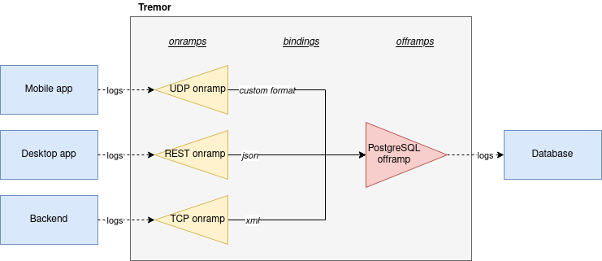
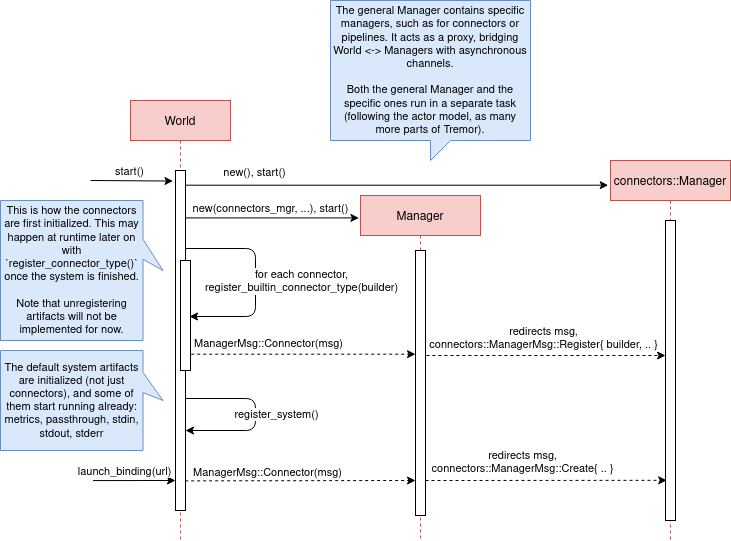
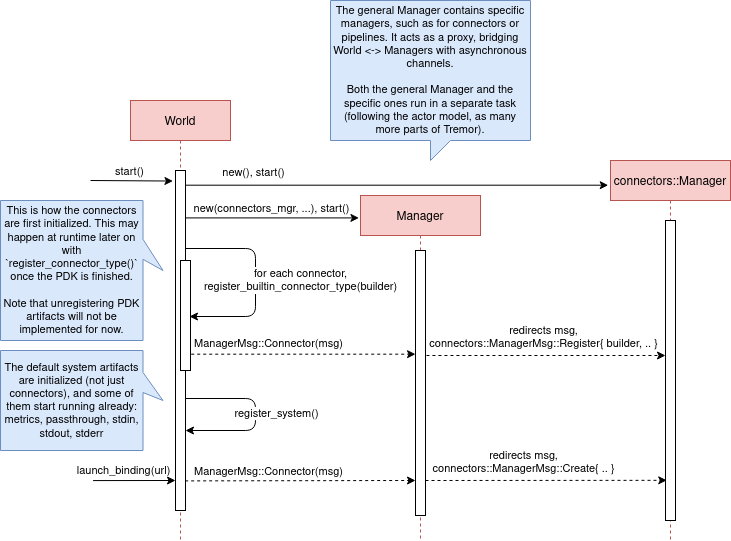
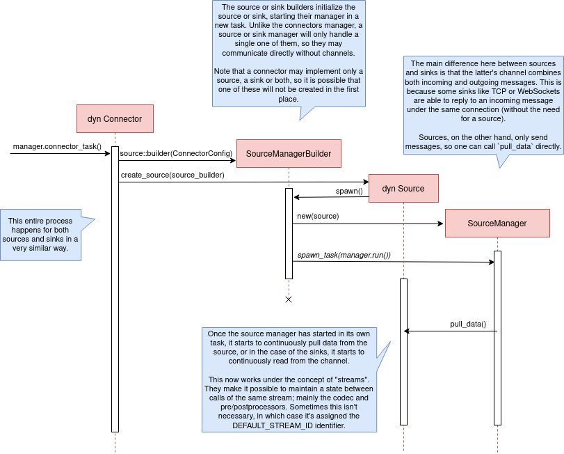

:sectnums:
:stem: latexmath

:repr-c: pass:quotes[`#[repr\(C)]`]

In the https://nullderef.com/blog/plugin-start/[last part] of this
https://nullderef.com/series/rust-plugins/[series] I wrote some simple
experiments of plugins both with WebAssembly and dynamic loading. After
discarding Wasm for this specific PDK, I wanted to try to get a more realistic
example with dynamic loading and work towards the final implementation.

Since the Tremor team suggested to begin by implementing connectors, we'll first
have to learn more about them. Matthias ran me through their current state in a
meeting, which I'll try to summarize. We won't need to know much for this
specific article, though.

== Learning more about connectors

////
2021-09-07 MEETING NOTES (CONNECTORS):

Connector trait:
* can contain a source, a sink, or both
* handlers like `on_start`, `on_pause`, etc
* `connect` retries until it returns `true`
* {Sink,Source}ManagerBuilder and similars are not actually generic, they *have*
  a generic function.
* how are plugins loaded and how are they specified: automatically if possible

Later on:
* Automatically search plugins, maybe $TREMORPATH
* Check all functions are exported in the plugin
* Make sure a plugin crash doesn't crash Tremor itself if possible. Can panics
  be caught?
* Check conflicting plugin names
////

First of all, https://www.tremor.rs/[Tremor] is an event processing system for
unstructured data. One of its many usages may be to:

. Receive logs from different applications in your business
. Filter, transform, and mix them up following the same structure
. Send all the now structured logs to your database

This currently works with
https://www.tremor.rs/docs/artefacts/onramps/[onramps/sources],
https://www.tremor.rs/docs/artefacts/offramps/[offramps/sinks] and pipelines:

* An onramp specifies how Tremor connects to the outside world (or pipeline) in
  order to _receive_ from external systems, such as
  https://www.tremor.rs/docs/artefacts/onramps/#tcp[TCP],
  https://www.tremor.rs/docs/artefacts/onramps/#metronome[periodically] or
  https://www.tremor.rs/docs/artefacts/onramps/#postgresql[PostgreSQL].
* An offramp specifies how Tremor connects to the outside world (or pipeline) in
  order to _publish_ to external systems, such as
  https://www.tremor.rs/docs/artefacts/offramps/#stdout[stdout],
  https://www.tremor.rs/docs/artefacts/offramps/#kafka[Kafka] or
  https://www.tremor.rs/docs/artefacts/offramps/#elastic[ElasticSearch].
* A pipeline is a set of operations (transformation, aggregation, dropping, etc)
  through which events can be routed.

The thing is that some onramps may not only want to receive from external
systems, but also respond to them directly, acting like an offramp, and
vice-versa. This is currently implemented with what's called
https://www.tremor.rs/docs/operations/linked-transports/["`linked transports`"],
and it's specifically useful for some onramps and offramps like REST and
websocket, where the protocol already provides facility for responding to events
with a single connection, for example with an ACK.

Basically,
https://github.com/tremor-rs/tremor-rfcs/blob/connectors-n-streams/text/0000-connectors-streams.md[connectors]
are just a way to abstract over both onramps and offramps under the same
concept, including linked transports. As the time of writing this article
they're still being implemented by Matthias in the
https://github.com/tremor-rs/tremor-runtime/tree/connectors[`connectors` branch]
of https://github.com/tremor-rs/tremor-runtime[tremor-rs/tremor-runtime], but
their interface, defined with the
https://github.com/tremor-rs/tremor-runtime/blob/883f13e29b4c6ec7b6703f2487aac321c738e7c8/src/connectors.rs#L739[`Connector`
trait], is somewhat stable.

It's important to keep the plugin interface as simple as possible. The
communication details should be left to the runtime, so that  the plugin can be
simplified to just exporting a number of synchronous functions. With this we can
avoid passing some complex types (`async`, channels, etc) between the runtime
and plugin, which can be impossible if you have to maintain ABI stability
( doesn't even support `async`).

Once this lean plugin interface is defined, we can create some kind of wrapper
in the runtime (a _manager_, in Tremor terms) that handles communication and
other similar tasks. This exact same thing is done by other crates such as , which is based on the C library ,
and implements a higher-level asynchronous interface on top of it.

== About Tremor

As always, these articles include a first section with content specific to
Tremor that you might <<actual_start,want to skip>>. Unfortunately, with time
this series will become more and more specific to Tremor; after all I'm just
reporting my progress on their PDK. Still, having a step-by-step walkthrough for
a real-life Plugin System will surely be helpful to those attempting to do the
same.

=== My next steps

In the first meeting we discussed the work I had exposed in my last update.
Despite the complications (being forced to use {repr-c}), the team liked where
the PDK was going.

They suggested me to start with connectors for the real-life example, even
though they were incomplete because Matthias was still working on them. The best
way to do this would be to copy the bare minimum from
https://github.com/tremor-rs/tremor-runtime[Tremor's repository] and try to get
the simplest Proof of Concept working.

In previous meetings we had discussed the possibility of having generics in the
interface, but that turned out to not be necessary at all. The `Connector`
trait had a workaround to avoid generics with `SinkManagerBuilder`.

=== On software engineering

At the end of the first meeting, Darach gave some very interesting advice for my
software engineering career, so I took note of it and reflected for a bit:

* As you get more experience in the field, you talk more and code less. The
  positions you're in become more about team management than programming. It's
  good to remember that software engineering isn't just coding. Also that with
  time, your personality changes, and you have to keep adapting.
* Team building isn't about getting a group of people to carry the exact same
  tasks in the same way. Everyone is different; you'll have to discover the
  strengths and weaknesses of each member and figure out how to mix them up. The
  best teams are often very heterogeneous, and it's pretty clear to me that this
  is the case with Tremor as well.
* Don't care about what others say about you (the _don't worry_ rule). Don't let
  "`You'll never end up being X`", "`You're bad at Y`" and similars ever affect
  you.
* Coding is mentally exhausting and burnout is a very common thing. Take good
  rest, breathe, and have fun. Taking a break from programming is a good idea
  from time to time.
+
I've personally experienced burnout myself so I know this first hand. You may
immerse yourself too much in computers or coding (specially under a pandemic
that restricts how much you can go out). Finding a hobby outside of that is
incredibly helpful.

////
2021-09-07 MEETING NOTES:

* start with connectors, don't worry that much b/c the real overhead lies in the
  external dependencies (networking/etc)
* copy stuff from connectors branch into new repo, forget everything else
  https://github.com/tremor-rs/tremor-runtime/blob/main/src/source/blaster.rs
  https://github.com/tremor-rs/tremor-runtime/blob/main/src/sink/blackhole.rs
* try to see if generics are avoidable
* benchmarks:

  cd tremor-cli
  tremor test bench tests
  
  (or)

  ./bench/run.sh <name>
* start async with callbacks for example instead of something more complicated
* for async take a look at how libkafka does it:
  https://github.com/fede1024/rust-rdkafka

* in team building, everyone is different and the team is very homogeneous, you
  have to figure out how to mix them up
* as you get older you talk more and code less
* remember that with time you change, and so does your position in the company
  (developing people instead of code)
* don't care about what others say about you (don't worry)
* take good rest, breathe, coding is mentally exhausting
////

=== How Tremor works

After starting to write the PDK example for connectors and failing because I
didn't know what I was doing, I decided to step back and try to understand in
detail how Tremor works. Once I had that covered, I could try to simplify the
PDK as much as possible in order to keep my sanity.

I jumped into the codebase of
https://github.com/tremor-rs/tremor-runtime[`tremor/tremor-runtime`] and tried
to figure out how it was structured, also with the help of the team later on.
First of all: Tremor is loosely based on the actor model. Quoting Wikipedia:

[quote, 'https://en.wikipedia.org/wiki/Actor_model[Actor model, Wikipedia]']
____
[The actor model treats the] actor as the universal primitive of concurrent
computation. In response to a message it receives, an actor can: make local
decisions, create more actors, send more messages, and determine how to respond
to the next message received. Actors may modify their own private state, but can
only affect each other indirectly through messaging (removing the need for
lock-based synchronization). 
____

It doesn't use a language (e.g. Erlang) or framework (e.g. , maybe in the future) that strictly follows the actor model, but it often
re-implements the same patterns manually. Tremor is currently implemented with
https://en.wikipedia.org/wiki/Asynchrony_(computer_programming)[asynchronous
programming], which means that instead of threads we'll be working with _tasks_,
a higher level concept. From the  documentation:

[quote, 'https://docs.rs/async-std/1.10.0/async_std/task/index.html[`async_std::task`], docs.rs']
____
An executing asynchronous Rust program consists of a collection of native OS
threads, on top of which multiple stackless coroutines are multiplexed. We refer
to these as “tasks”. Tasks can be named, and provide some built-in support for
synchronization.
____

We could summarize this with the sentence "`Tremor is based on actors running in
separate tasks which communicate asynchronously via channels`". The main actor
is called the `World`. It contains the state of the program, such as the
available artifacts (_repositories_) and the running ones (_registries_), and
it's used to initialize and control the program.

I'll try to follow what Tremor does in order to get a connector running with the
help of a few diagrams. The following diagram showcases what happens when a
`World` is created. This introduces the concept of _Managers_, which simply are
actors in the system that wrap up some functionality.

Managers help decouple the communication and the implementation of the
underlying functionality. They are also useful to remove some boilerplate when
initializing the components, such as creating the communication channel or
spawning the component in a separate task.

Generally, there's one manager per artefact type, which helps with their
initialization process, and then there's one manager per running instance,
handling their communication details.

Once all the managers are initialized, Tremor currently registers all the
built-in artifacts in a "`hardcoded`" way with `register_builtin_types`. But
after the PDK is implemented, this will happen dynamically, i.e. Tremor will
automatically look for DLL/SO files in its configured directory and try to
register all the plugins it can find. The user may additionally request a
specific plugin to be loaded while Tremor is running.

Note that the initialization of the connectors is done in two steps: first
they're _registered_, which just means that the connector is now available for
loading (they're added to the _repository_). The connector doesn't actually
start running until a binding is created with it, for example with
`launch_binding`, which will remove it from the repository and add it to the
_registry_, with the currently running artifacts.

`connectors::Manager` contains all the connectors running in Tremor, which we'll
now try to understand:

Since it's a multi-step process (it's actually more complicated than
registration + creation), the first part of it already provides the tools to
initialize the connector (mainly the builder). When the connector needs to start
running because it's been added to a binding in the pipeline, the builder helps
to construct it generically with the previously provided configuration details.
Finally, it's moved into a task of its own, so that it may communicate with
other parts of Tremor.

Now that we have a connector running, let's see how it's split up into the
source and sink parts. In a very similar way, a builder is used to initialize
the underlying source, sink, or both, and then a new task is spawned for them.

A manager is also created for each instance of source/sink, which will handle
the communication with other actors. This way, the source and sink interfaces
can be kept as simple as possible. These managers will receive connection
requests from the pipeline and then redirect or read from it.

The main difference between sinks and sources currently is that the former can
also reply to messages within the same connection. This is useful to acknowledge
the package ("`Ack`") or to notify something has failed in the sink ("`Fail`"
for a specific event, "`CircuitBreaker`" to completely stop data from being
sent).

Some connectors are based on _streams_. They are equivalent for example to TCP
streams, which help to group up messages and avoid mixing them up. They are
manually started and ended via messages, and the manager saves their state in a
field called `states` (since for instance preprocessors may need to keep a
state). If a connector doesn't need this, such as the `metronome`, it may simply
specify `DEFAULT_STREAM_ID` as the stream ID always.

Codecs and preprocessors are involved here both at the source and sink levels.
In the source part, the data is transformed or split up through a chain of
preprocessors and then the codec is applied. For the sinks, the inverse process
is followed: the data is first encoded into bytes with the codec, and then a
series of post-processors are applied to the raw binary data.

After the full interface of connectors is done, I could implement the two
following connector plugins:

* https://github.com/tremor-rs/tremor-runtime/blob/main/src/sink/blackhole.rs[Blackhole]
  is used for benchmarking. It takes measurements of the end to end times of each
  event traversing the pipeline and at the end prints an HDR (High Dynamic
  Range) http://hdrhistogram.org/[histogram].
* https://github.com/tremor-rs/tremor-runtime/blob/main/src/source/blaster.rs[Blaster]
  replays a series of events specified in a file, which is specially useful for
  performance testing.

Both of these are relatively simple and will be helpful to benchmark the PDK
later on. But that isn't really important right now; I first need to get the PDK
working, and then I can care about performance.

[[actual_start]]
== Taking a look at eBPF first

In the previous articles I mostly considered using either WebAssembly or Dynamic
Loading. What I didn't even know about is https://ebpf.io/[eBPF], "`a
revolutionary technology with origins in the Linux kernel that can run sandboxed
programs in an operating system kernel`". However, similarly to WebAssembly, its
usage has been expanded to user-space applications. eBPF defines a set of
bytecode instructions that may be ran by a virtual machine anywhere, similarly
to how Wasm works.

There are multiple active crates for eBPF in Rust. ,  and  are specific to the Linux Kernel.  is a virtual machine, so it only works for user-space. The
maintainers of the latter use it to https://solana.com/[safely run apps on the
blockchain], and their crate seems to be a fork of the now abandoned (?) . https://www.youtube.com/watch?v=xj0PBFjLm1U&t=8701s[This recent
talk at LPC 2021] explains the situation of eBPF in Rust quite well (mainly for
Aya, so it's mostly related to the Linux Kernel).

Unlike WebAssembly, you don't necessarily need to serialize or write to an
intermediate memory. Since you fully control how the virtual machine works, the
runtime could implement a custom sandbox that simply checks for the read/written
addresses in the plugins to make sure they aren't out of bounds, while still
sharing the same memory space. So in terms of performance, Tremor itself _could_
use it -- though there's still the penalty of interpreting plugins instead of
running them natively.

The problem in this case is that, for what I've found, Rust support leaves to be
desired. Most people seem to use C for eBPF and I think it shows; the number of
tutorials/guides/articles about eBPF on Rust is incredibly small. There's no
official target to compile Rust to eBPF, and the only user-space runtime we can
use is `rbpf` and its derivatives. Looking for information about this topic was
somewhat frustrating, specially because the search results are mixed up with
kernel-only BPF, which is not relevant to us.

It doesn't really seem like the best choice right now, in my opinion. We would
have to write almost everything about the plugin system from scratch, including
the sandbox itself (allowing only different sets of syscalls, bounds checking,
etc). It would be considerably more cumbersome than using something like
`abi_stable`. Maybe in the future it'd be worth considering it in detail and
running some benchmarks, but for now I think dynamic loading is still the clear
winner for Tremor. Still, I'm surprised by how flexible eBPF seems to be, and
how it's possible to avoid the memory barrier problem found in Wasm.

Cheers to Dr. Florentin Rochet for letting me know about this technology --
though he's considering switching to WebAssembly for his project. He's currently
using it to research _pluggable_ anonymous protocols like Tor, which would allow
patches to their code to happen at runtime <<florentin-1>> <<florentin-2>>
<<florentin-3>> <<florentin-4>>. This makes it faster to fix vulnerabilities
until it's properly updated upstream, among other things. Pretty cool :)

== Getting deeper into dynamic linking

Now that we definitely know how to approach the PDK, we have two choices: using
raw dynamic linking with the C ABI and `libloading`, or trying out the
`abi_stable` crate. I suggest we do both. We'll most likely end up using the
latter because it should be easier and safer, but it's still a very good idea to
know how `abi_stable` works under the hood.

In the previous article I created a `dynamic-simple` experiment in examples to
https://github.com/marioortizmanero/pdk-experiments[the pdk-experiments
repository]. In this one we'll try to get an implementation that's closer to
what we need for connectors, so I'll call the new experiment
https://github.com/marioortizmanero/pdk-experiments/tree/master/dynamic-connectors[`dynamic-connectors`].

== Versioning

In order to get more advanced things running, we should figure out how to
properly embed metadata in the plugin. In order to export any type, we already
know that it must be FFI-safe. But there's something else of great importance:
versioning. In order to safely load the plugin, one must ensure that the
versions of the `common` crate match -- or at least that they're compatible --
for both the runtime and the plugin. Here's an example of how this could go
wrong if we don't save information about versioning:

.Plugin implementation
[source, rust]
----
pub mod common {
    // This is the declaration for the plugin data in version 0.1
    #[repr(C)]
    pub struct PluginData {
        pub name: &'static [u8],
        pub new: unsafe extern "C" fn() -> State,
    }
}

#[no_mangle]
pub static PLUGIN_DATA: common::PluginData = common::PluginData {
    name: b"test",
    new
};
----

.Runtime implementation
[source, rust]
----
pub mod common {
    // And this is the same type, but in version 0.2
    #[repr(C)]
    pub struct PluginData {
        pub name: &[u8],
        pub new: unsafe extern "C" fn() -> State,
        // NOTE: this field is new here!
        pub connect: unsafe extern "C" fn(&mut State) -> bool
    }
}

fn main() -> Result<(), anyhow::Error> {
    unsafe {
        let library = Library::new(path)?;

        let data = library
            .get::<*const common::PluginData>(b"PLUGIN_DATA")?
            .read(); // !!! UNDEFINED BEHAVIOUR !!! What will `data.connect` be?
    }

    Ok(())
}
----

In the code above, we can see that, even though both versions of `PluginData`
are FFI-safe, their layouts aren't the same, because the last one has a new
field. When trying to read `PLUGIN_DATA`, undefined behaviour will occur (most
likely accessing to an invalid memory address).

Every plugin should at least export the version of `common` it uses, and the
runtime should check it before anything else.

Specifically, the type used to export the version has to be:

* *FFI-safe*, so `&str` or `CStr` are discarded (the latter is a Rust wrapper and
  not {repr-c}).
* *Stable*. `abi_stable::Rstr` won't work either because the versions for
  `abi_stable` might mismatch, since we're reading the symbol before knowing
  that. Its layout must be _always_ the same.
* *Thread-safe* (implement `Sync`). If we wanted to use something like `*const
  c_char`, the compiler would throw the following error, because it's a pointer:
+
[source, text]
----
error[E0277]: `*const i8` cannot be shared between threads safely
 --> src/lib.rs:4:1
  |
4 | pub static VERSION: *const c_char = b"0.1.0\0".as_ptr() as _;
  | ^^^^^^^^^^^^^^^^^^^^^^^^^^^^^^^^^^^^^^^^^^^^^^^^^^^^^^^ `*const i8` cannot be shared between threads safely
  |
  = help: the trait `Sync` is not implemented for `*const i8`
  = note: shared static variables must have a type that implements `Sync`
----
+
Instead, we can use a function that returns the string:
+
[source, rust]
----
#[no_mangle]
pub extern "C" fn get_version() -> *const c_char {
    b"0.1.0\0".as_ptr() as _
}
----

Finally, there are multiple ways to handle versioning within the runtime,
depending on how fine-grained (but also more error-prone) it should be:

* The simplest way possible: both version strings must be strictly the same.
* The plugin system could take advantage of https://semver.org/[semantic
  versioning]. Only differences in the major version (X.0.0) would be
  incompatible. The problem in this case is that this is kept track of manually,
  and it's possible that a breaking change is introduced by mistake.
* Since there are actually many kinds of plugins (connectors, codecs, etc),
  rather than checking the version for the entire `common` crate, there could be
  a version _per type of plugin_. If a change in the `common` crate only
  modifies structures for codec plugins, the rest of the plugins would still
  work.

== Loading plugins

Another complicated topic is plugin distribution and management. In order to
make it easier for the user, plugins should be found and loaded automatically.
But how exactly should this work? I'll explain a few ideas.

First of all, the plugins can be found automatically by searching one or more
user-configurable directories. For instance, in Tremor's case we could use the
environment variable
https://www.tremor.rs/docs/tremor-query/modules#defaults[`TREMOR_PATH`]. Once we
have a list of directories where we should look for plugins there are two ways
to do it:

* Only checking the immediate files in the directory
* Recursively, which is more convenient but might cause issues if the node is
  too deep. If the user specified `/` as a directory, the runtime would most
  likely crash unless we used something efficient like
  https://github.com/sharkdp/fd[`fd`] or added a depth limit (which is probably
  the most sensible choice here).

Once we're traversing a directory, we have to figure out which files are plugins
and which aren't. The easiest way to do it is with file extensions, but this
introduces the problem of cross-compatibility. Dynamic libraries usually have a
different extension name for each Operating System: Windows uses `.dll`, Linux
and FreeBSD use `.so`, and MacOS uses `.dylib`, as specified by
https://doc.rust-lang.org/std/env/consts/constant.DLL_EXTENSION.html[`std::env::consts::DLL_EXTENSION`].
It would make sense that our runtime only tried to load plugins with their
respective extensions.

However, these extensions are just conventions; we could just enforce a single
extension name, as
https://docs.rs/libloading/0.7.0/libloading/struct.Library.html#tips[`libloading`
suggests]. It might be easier if we just used `.module` for everything, for
example. In order to make them even more convenient, it'd be nice if they also
worked for all of these Operating Systems within a single file. Apparently, this
is called a https://en.wikipedia.org/wiki/Fat_binary["`Fat binary`"] and it was
used in the past, but it'd be extremely complicated to get working now
<<fat-binaries>>, so we'll just forget about it.

Additionally, the Tremor plugin system requires that plugins can be loaded _both
at initialization time and at runtime_. There is a decision to be made in here
about how the latter should work:

* Manually: after adding the new plugin to the configured directories (or
  specifying its full path), the user would input in some way that it should be
  loaded (for example with the CLI tool).
* Automatically: the runtime could detect whenever a new plugin is added to the
  list with a crate like . Most Operating Systems have some
  way to get a notification whenever a file or directory changes. In case a new
  file was added to any of the configured directories, the runtime could try to
  load it. This way, it'd work with no user interaction, other than adding the
  file to one of the directories.
* A combination of both: if the directories configured to look for plugins can't
  be changed at runtime it might be interesting to also let the user manually
  load plugins in specific paths.

== Handling state

Most plugins will want to keep some kind of state between calls to its
interface. For example, the TCP connector will need to keep its socket after its
initialization in order to send or receive messages. This means that most of
them will follow the following pattern:

[source, rust]
----
let state = plugin.new();
plugin.something(&mut state);
----

The state is first created with a `new` function that initializes everything as
needed, and then a mutable reference is passed to its functions. The main
problem here is, if each plugin is going to have its own type of state, what's
the function signature of `Plugin::something`, defined in `common`?

=== Generics in plugins?

In a regular Rust project we'd just make `Plugin::something` generic over a
common trait that all states should implement. Unfortunately, generics in
plugins are fundamentally impossible. In Rust, monomorphization turns generic
code into specific code by filling in the concrete types that are used when
*compiled* <<generics>>. Plugins are loaded at runtime, so they may want to use
types the compiler didn't generate code for.

It's really easy to prove in Rust with the following example. We'll try to
_load_ an external function with generics:

[source, rust]
----
extern "C" {
    fn foo<T>(_: T);
}
----

This results in the following error:

[source, text]
----
error[E0044]: foreign items may not have type parameters
 --> src/lib.rs:2:5
  |
2 |     fn foo<T>(_: T);
  |     ^^^^^^^^^^^^^^^^ can't have type parameters
  |
  = help: replace the type parameters with concrete types like `u32`

error: aborting due to previous error

For more information about this error, try `rustc --explain E0044`.
----

Interestingly enough, the compiler lets you export generic functions declared
_in Rust_:

[source, rust]
----
extern fn foo<T>(_: T) {}
----

This confused me in the beginning; it made me think generic functions through
FFI were somehow be possible. But as described in
https://github.com/rust-lang/rust/pull/15831[the original issue that allowed
them], they're only supported to pass callbacks to C functions.

Note that generics in plugins do work for lifetimes. This will compile:

[source, rust]
----
extern "C" {
    fn foo<'a>(_: &'a str) -> &'a str;
}
----

Even though lifetimes and generics share the same syntax, in the case of
lifetimes they are only annotations for the Rust compiler; monomorphization is
not applied.

If you want to know more about this topic I'd suggest watching
https://www.youtube.com/watch?v=xcygqF5LVmM[this video by Jon Gjengset].

=== `dyn` in plugins?

The alternative to generics is often using trait object types with `dyn`. Again,
will that work for plugins? Let's try:

[source, rust]
----
pub trait PluginState {}
pub extern fn foo<T>(_: &dyn PluginState) {}
----

Compiling...

[source, text]
----
warning: `extern` fn uses type `dyn PluginState`, which is not FFI-safe
 --> src/lib.rs:2:25
  |
2 | pub extern fn foo<T>(_: &dyn PluginState) {}
  |                         ^^^^^^^^^^^^^^^^ not FFI-safe
  |
  = note: `#[warn(improper_ctypes_definitions)]` on by default
  = note: trait objects have no C equivalent
----

Nope. `dyn` is strictly part of the Rust ABI, so it's not stable for our plugin
system.

=== The C way

There are two popular ways to approach this in C:

. Globals, but they are hard to deal with in concurrent programs
. `void*`, which is a pointer with no associated type <<void-ptr>>

For safety's sake, let's see how the second one works. This pattern is used for
example in PulseAudio <<pulseaudio-ptr>>, in which callbacks pass a `void*`
parameter for user data. Here's a simpler program:

[source, c]
----
#include <stdio.h>
#include <stdlib.h>

// The state of the plugin
typedef struct {
    int counter;
} plugin_state_t;

// Exported by the plugin, initializes the state
void* new() {
    plugin_state_t* plugin_state = malloc(sizeof(plugin_state_t));
    plugin_state->counter = 0;
    return (void*) plugin_state;
}

// Exported by the plugin, which takes a pointer to its state
void something(void* state) {
    // We know the runtime used `new` to initialize the state, so we can cast it
    // back to its original type.
    plugin_state_t* plugin_state = (plugin_state_t*) state;

    printf("Current state: { counter = %d }\n", plugin_state->counter);
    plugin_state->counter++;
    printf("Final state: { counter = %d }\n", plugin_state->counter);
}

int main() {
    // We initialize the plugin, which returns its state
    void* state = new();
    // When calling anything from the plugin we pass its state
    something(state);
    // Don't forget!
    free(state);
}
----

This does work perfectly, and we could port it to Rust as a straightforward
solution. However, it has the following inconvenients:

* It's very `unsafe`. We'd need to add some kind of wrapper/macro for the plugin
  developers to avoid invoking undefined behaviour.
* We know nothing about the state. A `void*` can't enforce `Debug` being
  implemented, nor any base other method or trait that might be of interest to
  us.

Based on how this works, we can try to extend it by implementing
intheritance-based polymorphism manually.
https://adventures.michaelfbryan.com/posts/ffi-safe-polymorphism-in-rust/[This
blog post by Michael
F. Bryan's] covers the topic extremely well.

Here's how our previous example would look like, which could be translated to
Rust with no problems whatsoever:

[source, c]
----
#include <stdio.h>
#include <stdlib.h>

// The base plugin type
typedef struct base_state_t {
    void (*print)(struct base_state_t *);
} base_state_t;

// The state of the plugin, child of the above type
typedef struct {
    base_state_t base;
    int counter;
} plugin_state_t;

// The implementation of `print` for the `plugin_state_t` child
void print(base_state_t* state) {
    plugin_state_t* plugin_state = (plugin_state_t*) state;
    printf("Current state: { counter = %d }\n", plugin_state->counter);
}

// Exported by the plugin, initializes the state
base_state_t* new() {
    base_state_t base = {print};

    plugin_state_t* plugin_state = malloc(sizeof(plugin_state_t));
    plugin_state->base = base;
    plugin_state->counter = 0;
    return (base_state_t*) plugin_state;
}

// Exported by the plugin, which takes a pointer to its state
void something(void* state) {
    // We know the runtime used `new` to initialize the state, so we can cast it
    // back to its original type.
    plugin_state_t* plugin_state = (plugin_state_t*) state;
    plugin_state->counter++;
}

int main() {
    // We initialize the plugin, which returns its state
    base_state_t* state = new();
    // When calling anything from the plugin we pass its state
    state->print(state);
    something((void*) state);
    state->print(state);
    // Don't forget!
    free(state);
}
----

The main difference in the code is the new base class `plugin_base_t`. It
defines a single function `print` that should be implemented by its children,
and it could also include other fields that would be inherited. Casting between
`base_state_t` and `plugin_base_t` is explicitly allowed by the C standard as
long as the base class is the first member in the struct, so this is sound.

This covers all of our necessities. The only remaining problem is that it's
still quite unsafe to use. Thankfully, we can avoid most user errors by using
the crate , which provides a very flexible
procedural macro to automatically write all the necessary boilerplate in Rust.

////
https://adventures.michaelfbryan.com/posts/ffi-safe-polymorphism-in-rust/
https://www.youtube.com/watch?v=xcygqF5LVmM&feature=emb_title

https://docs.rs/thin_trait_object/1.1.2//
////

[[error_handling]]
== Error Handling

I've created a few more plugins to see how this approach reacts to some common
errors. Since in the end we aren't using a sandbox, I wonder what kind of errors
we _can't_ recover from.

=== Missing fields

The `plugin-missing` directory contains an empty plugin. It doesn't export any
fields at all, like the name or the version. This one is already handled by
`libloading`, actually. When using `library.get("name")`, if `"name"` is not
exported by the shared object, the following error will show up:

[source, text]
----
$ make debug-missing
Error when setting up the plugin: plugin-missing/target/debug/libplugin_missing.so: undefined symbol: get_name
----

=== Version mismatch

After implementing the versioning system, we can see how these kinds of errors
can be caught safely:

[source, text]
----
$ make debug-versionmismatch
Initializing plugin versionmismatch
Version mismatch. Aborting.
Error when setting up the plugin: version mismatch: 0.0.0 incompatible with 0.1.0
----

=== Wrong type

Libloading assumes the type that's being loaded is correct. If for example the
plugin exported the `get_name` function, but it returned an integer instead of a
string, we'd be in undefined-behaviour-land:

[quote, 'https://docs.rs/libloading/latest/libloading/struct.Library.html#safety-1']
____
Users of this API must specify the correct type of the function or variable
loaded. Using a `Symbol` with a wrong type is undefined.
____

Ignoring this will cause an unavoidable segfault:

[source, text]
----
$ make debug-wrongtype
Segmentation fault (core dumped)
----

=== Wrong address

Unfortunately, there's not much we can do about out of bounds pointers. If the
plugin exports e.g. the name with a null pointer, we'll just get a segmentation
fault:

[source, text]
----
$ make debug-wrongaddress
Segmentation fault (core dumped)
----

In order to avoid this, the runtime could manually check that the pointer isn't
zero, the usual value for null. But the same would still happen if the pointer's
value was 1 instead of 0. And even if it was within bounds, it could just point
to garbage anyway.

=== Panicking

Panicking is not supported in the C ABI; it's considered undefined behaviour
<<panic-ffi>>. If a plugin panics, the entire program will most likely abort.
Plugin developers should wrap every single exported function in
https://doc.rust-lang.org/std/panic/fn.catch_unwind.html[`catch_unwind`] in
order to not crash the entire runtime when something goes wrong:

[source, text]
----
$ make debug-panic
Segmentation fault (core dumped)
----

== Full implementation

The example at
https://github.com/marioortizmanero/pdk-experiments/tree/master/dynamic-connectors[`dynamic-connectors`]
approaches the topics covered in this section in the simplest of ways, while
still implementing a working plugin system. More specifically:

* Versioning requires an exact match between the version of `common` in the
  plugin and the runtime.
* The plugins are manually loaded given a directory.
* The runtime looks for plugins in the immediate files of the directory, i.e.
  non-recursively.
* The state is passed as a void pointer, rather than trying to use inheritance.

Most of these are just decisions to be made by the designer of the system. I
chose to go for the easiest options so that we can focus on `abi_stable` sooner.

I did implement a declarative macro to make plugin-writing easier and less
error-prone, just to see how it'd work. It takes care of most of the
boilerplate, which basically consists on creating functions for the name, kind,
and version returning `*const c_char`, and exporting the plugin data struct. For
the curious, it's defined in the `common` directory.

.Sample usage of the macro
[source, rust]
----
define_connector_plugin! {
    name: "metronome",
    data: ConnectorPlugin {
        new,
        something,
        is_sink: false,
        is_source: true
    }
}
----

The plugin system supports multiple types of plugins (connectors, codecs, etc),
so there's actually a specific macro and data structure for each of them.

Apart from the examples listed in the <<error_handling>> section, I've created a
proper plugin that is supposed to work, with the name `plugin-metronome`. It was
supposed to implement the
https://www.tremor.rs/docs/artefacts/onramps#metronome[`metronome` connector],
but I've decided to just leave that for the next post. I'd rather spend my time
writing the real-life example with the `abi_stable` version, because it's what
we'll end up using.

== Conclusion

This article has covered a lot of questions that one may encounter when trying
to use dynamic loading for a plugin system. It's definitely a complicated task
with lots of decisions to make, and plenty of pitfalls. This is why I'd love to
try `abi_stable` in detail, which would let us do the same things but without a
line of `unsafe`.

In my opinion, although `abi_stable` is a very large crate and somewhat hard to
learn, most of the problems this post exposes are greatly simplified thanks to
it. In the next article I'll see the differences between both approaches. 

[bibliography]
== References

- [[[florentin-1,     1]]] https://pluginized-protocols.org/
- [[[florentin-2,     2]]] https://pquic.org/
- [[[florentin-3,     3]]] https://petsymposium.org/2019/files/hotpets/proposals/rochet-fan.pdf
- [[[florentin-4,     4]]] https://petsymposium.org/2019/files/hotpets/slides/rochet-fan-slides.pdf
- [[[fat-binaries,    5]]] https://stackoverflow.com/a/63346857/11488352
- [[[generics,        6]]] https://doc.rust-lang.org/book/ch10-01-syntax.html#performance-of-code-using-generics
- [[[void-ptr,        7]]] https://www.learncpp.com/cpp-tutorial/void-pointers/
- [[[pulseaudio-ptr,  8]]] https://freedesktop.org/software/pulseaudio/doxygen/stream_8h.html#a2dcc985c65964da290a0c2e1bf103175
- [[[panic-ffi,       9]]] https://doc.rust-lang.org/nomicon/ffi.html#ffi-and-panics
