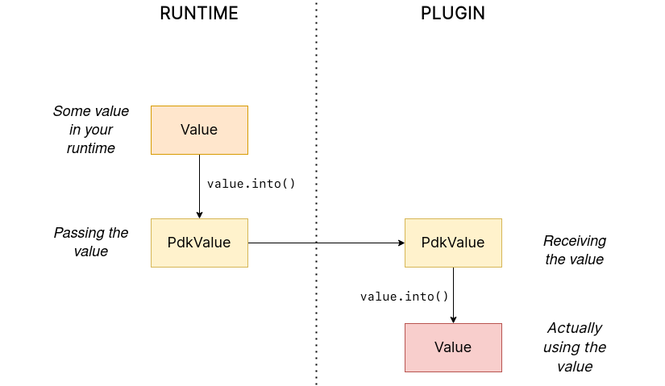

:sectnums:
:stem: latexmath

:repr-c: pass:quotes[`#[repr\(C)]`]
:repr-rust: pass:quotes[`#[repr(Rust)]`]
:work: pass:quotes["`just make it work`"]
:heinz: https://twitter.com/heinz_gies/:[Heinz]

Welcome to one of the last articles of
https://nullderef.com/series/rust-plugins/[this series]!
https://nullderef.com/blog/plugin-abi-stable[Previously], we covered how to use
external dependencies to lessen the work necessary to implement our plugin
system. Now that we know how to actually get started, we'll implement it once
and for all.

I will personally use the crate , but the concepts
should be roughly the same for any dynamic loading method. Similarly, some of my
advice is related to modifying an already existing project of large size. If
you're starting from scratch with a plugin system (PDK) in mind, it should be
the same, just easier in some aspects.

[[advice]]
== Some prototyping advice

Before anything else, I'd like to give out some suggestions regarding
refactoring with Rust, based on my experience. You'll be introducing a good
amount of changes, so it would be wise to do some brief planning beforehand --
otherwise it'll take forever with a complex enough codebase. Maybe this will all
be obvious to you, or you may prefer taking a different approach. But it
certainly worked for me, so it's worth a shot. I'm personally very satisfied
about how much I've learned about the process.

=== The {work} approach

What I personally struggled the most to get drilled into my head is not getting
lost in the details. *First of all, we just want it to work*. I'll repeat. First
of all, we just want it to *work*. As long as the plugin system runs, the
following are completely fine:

* Ugly code (non-idiomatic, repetitive, somewhat messy, etc)
* Non-performant code
* Poor documentation
* No tests
* No clippy

Or, more specific examples:

* If stuck with lifetimes, just slap a `.clone()` in there and call it a day.
* A good ol' `.unwrap()` will make your life easier in case of doubt.
* You can resort to "`dirty`" or unnecessary type conversions if necessary.
* Just pulling in a new dependency instead of implementing something more
  tailored to your use-case from scratch will save you a lot of time.
* If something that's not really important is taking you too much time, you can
  always resort to a `// TODO` or `// FIXME`.

I will say that not working on tests until the plugin system is running is
definitely arguable for those who prefer to follow a test-driven development.
However, I personally didn't feel the need to write any tests in this case;
thanks to Rust's strong type system, it was mostly a compiler-driven
development. My progress basically consisted on making some changes and then
trying to make the compiler happy about them, repeatedly. I only moved to the
testing step once I was happy enough with the results, and everything seemed to
work when running it manually.

Furthermore, premature optimization is the source of all evil. You're not at a
point where that's important yet. Once you're done, you can actually spend some
time profiling and benchmarking in order to know which optimizations are worth
your time. Don't get me wrong -- you can certainly worry about choosing an
approach that's appropriate in terms of performance, which is why I discarded
WebAssembly or IPC at the beginning. But definitely give up on trying to avoid a
`clone` that might not actually affect your program speed after all.

My point is that every test, clean-up or optimization you try to make at this
stage will very likely end up being wasted effort. You'll reach a blocker at
some point later on, and have to rethink and rewrite lots of stuff. When
everything compiles, seemingly runs fine, and you consider it a decent approach,
you can actually start working on these points. Just keep note of what can be
improved so that you don't forget.

Note that it is okay to "`waste`" effort on wrong approaches, because you aren't
really "`wasting`" it; they're a necessary step to arrive to the final solution.
But it's painful to delete code you've spent time thinking about, so we should
at least try to minimize it.

=== Specific to Rust

==== Disable the annoying warnings

The first thing I did was remove some warnings the compiler will print when
you're prototyping. By default, a Rust program still compiles with warnings, but
in my experience, they're always in the way when trying to deal with actual
errors. For example, I don't care that an import is unused at all. I'll fix it
once I'm done, but please let me keep trying to "`make this work`"!

[source, rust]
----
// TODO: disable and cleanup with `cargo fix` automatically once done
#![allow(unused)]
#![allow(dead_code)]
----

Note that I'm not using `#![allow(warnings)]`, because most warnings will
actually be really helpful when refactoring to avoid early bugs. We just want to
get rid of the annoying ones, such as unused functions or imports, or dead code
that we haven't cleaned up yet, which are usually harmless.

One month later, I was able to finally compile
https://github.com/tremor-rs/tremor-runtime[`tremor-runtime`] with the initial
PDK prototype. This screenshot made my day, as simple as it may seem:

Afterwards, I removed these `allow` statements, ran `cargo fix && cargo fmt`,
and cleaned up a bit. `cargo fix` is built-in, and will automatically take care
of the trivial warnings, such as unused imports, saving _lots_ of time doing
cumbersome work.

==== Don't touch previous `use` statements

As my Pull Request got bigger and bigger, I started running into problems with
Git. The parent branch was also undergoing changes from a team of three people,
so it was updated quite often. All of this resulted into frequent conflicts, and
having to painfully resolve them many times until I got the hang of it.

Say, you have a number of `use` statements at the top of your file. After adding
some changes related to the PDK, you now need to import `PdkValue` as well.
You'd usually do:

[source, diff]
----
-use tremor_value::{Value, ValueTrait};
+use tremor_value::{Value, ValueTrait, PdkValue};
----

The problem is that if the parent branch later adds or removes one of the items
in that `use` statement, you may encounter a conflict. Git isn't smart enough to
handle Rust import statements (although that'd be pretty cool). Multiply this by
100 statements, and you might eventually go crazy. You can keep your sanity by
adding the new item in a separate block of ``use``s instead:

[source, diff]
----
-use tremor_value::{Value, ValueTrait};
+
+use tremor_value::PdkValue;
----

Same thing may happen if `tremor_value` wasn't imported and you have to add a
new line to the already existing `use` block:

[source, diff]
----
 use more_stuff::{X, Y, Z};
+use tremor_value::PdkValue;
 use other_stuff::{A, B, C};
----

In my experience, Git also trips up with this sometimes. You can follow the same
advice:

[source, diff]
----
 use more_stuff::{X, Y, Z};
 use other_stuff::{A, B, C};
+
+use tremor_value::PdkValue;
----

In summary, you can just create a new block after all the previous ``use``s and
add your stuff in there. You can clean it up at the end or in a different pull
request.

This is harder to do if you're _removing_ `use` statements. But if you also
followed the previous section about ignoring annoying warnings, it won't be a
problem in the first place. You can just leave the unused imports and clean up
when you're done with the PR.

== Defining the plugin interface

The first step that we can do is define the interface of the plugin system,
i.e., what a plugin binary must implement in order to be loadable by the
runtime. If you're doing this over an already existing codebase, you'll probably
get tons of errors. We'll ignore them for now; this is only our first sketch,
and you'll end up changing it a thousand times anyway. Some types in the
interface may not exist yet, or they may not be meant to be used for FFI. But
it'll serve us as an initial list of things to work on.

In my case, it first looked as follows. The specifics about how this works with
 are explained in the
https://nullderef.com/blog/plugin-abi-stable/[previous post].

[source, rust]
----
/// This type represents a connector plugin that has been loaded with
/// `abi_stable`. It serves as a builder, making it possible to construct a
/// trait object of `RawConnector`.
#[repr(C)]
#[derive(StableAbi)]
#[sabi(kind(Prefix))]
pub struct ConnectorMod {
    /// the type of the connector
    pub connector_type: extern "C" fn() -> ConnectorType,

    /// create a connector from the given `id` and `config`
    ///
    /// # Errors
    ///  * If the config is invalid for the connector
    #[sabi(last_prefix_field)]
    pub from_config: extern "C" fn(
        id: RString,
        config: ROption<Value>,
    ) -> FfiFuture<RResult<BoxedRawConnector>>,
}

/// Marking `ConnectorMod` as the main module in this plugin. Note that
/// `ConnectorMod_Ref` is just a pointer to the prefix of `ConnectorMod`.
impl RootModule for ConnectorMod_Ref {
    /// The name of the dynamic library
    const BASE_NAME: &'static str = "connector";
    /// The name of the library for logging and similars
    const NAME: &'static str = "connector";
    /// The version of this plugin's crate
    const VERSION_STRINGS: VersionStrings = package_version_strings!();

    /// Implements the `RootModule::root_module_statics` function, which is the
    /// only required method for the `RootModule` trait.
    declare_root_module_statics! {ConnectorMod_Ref}
}
----

My task was to turn the `Connector` trait into a plugin. All the `Connector`
implementors were meant to be constructed with `ConnectorBuilder`, and from that
moment on Tremor was able to use them generically with `dyn Connector`. Thus, I
thought the best idea would be to turn `ConnectorBuilder` into my `RootModule`
under the name `ConnectorMod`. Once the plugin was loaded, it would be possible
to construct the connector with the `from_config` function. I used
``abi_stable::sabi_trait``'s macro functionality, making `dyn` usage possible
within FFI.

For reference, when I first wrote `ConnectorMod`, `Value` wasn't even {repr-c}.
I had also added the `#[sabi_trait]` attribute to the `RawConnector` trait
declaration, but the types used there weren't {repr-c} either. So I had tons of
errors everywhere, but that was OK. I would be working on them step by step
until it compiled again.

If you're using  directly then you would be implementing
the interface via a struct with function pointers instead, and you'd need to
store metadata about the plugin with constants. But in the end, it boils down to
the same thing; just with different amounts of boilerplate.

== Recursively making everything {repr-c}

Now, this is the actually complicated part. The previous step may have seemed
simple, but you might find yourself falling into madness as you realize that you
need to make all the types in your interface {repr-c}, and also all the fields
each of these types hold, and so on...

It's very likely that you'll eventually find types without an FFI alternative in
. These will most likely be external types, but things
like async are a bit complicated to deal with as well. In the case of Tremor,
the most problematic part was the `Value` type. It's used to represent a
JSON-like payload; roughly defined as follows:

[[value_decl]]
[source, rust]
----
pub enum Value {
    /// Static values (integers, booleans, etc)
    Static(StaticNode),
    /// String type
    String(String),
    /// Array type
    Array(Vec<Value>),
    /// Object type
    Object(Box<HashMap<String, Value>>),
    /// A binary type
    Bytes(Vec<u8>),
}
----

In order to be able to use `Value` in the plugin system, it can be converted to:

[source, rust]
----
#[repr(C)]
#[derive(StableAbi)] // Only necessary for abi_stable
pub enum Value {
    /// Static values (integers, booleans, etc)
    Static(StaticNode),
    /// String type
    String(RString),
    /// Array type
    Array(RVec<Value>),
    /// Object type
    Object(RBox<RHashMap<RString, Value>>),
    /// A binary type
    Bytes(RVec<u8>),
}
----

The first problem arises in the `Static` variant:
https://docs.rs/value-trait/latest/value_trait/enum.StaticNode.html[`StaticNode`]
is a {repr-rust} _external_ type. It's from our 
dependency, and it may hold different basic types: numbers, booleans, or just
nothing.

[source, rust]
----
pub enum StaticNode {
    I64(i64),
    U64(u64),
    F64(f64),
    Bool(bool),
    Null,
}
----

This could be fixed by simply applying the very same procedure again (hence
_recursively_ until everything is {repr-c}). Here it will finally work because
there aren't any other {repr-rust} types in `StaticNode`:

[source, rust]
----
#[cfg_attr(feature = "abi_stable", repr(C))]
#[cfg_attr(feature = "abi_stable", derive(abi_stable::StableAbi))]
pub enum StaticNode {
    I64(i64),
    U64(u64),
    F64(f64),
    Bool(bool),
    Null,
}
----

Since it's an external library, we'll have to make a Pull Request and hope that
the author is okay with the changes. `abi_stable` should be optional so that
this change is applied only to those that actually need {repr-c} in the library.
You could also go a step further and differentiate between enabling {repr-c} and
deriving `StableAbi` for those that don't need the latter.

[.text-center]


== Overcoming problems with {repr-c}

Awesome. We got `Value` working now for FFI. Right? No? Oh. It seems like the
compiler strongly disagrees. By changing the variants of `Value`, a great amount
of the code that used it will now fail to compile in multiple ways:

[source, rust]
----
// Won't work because Value::Array holds an RVec now
let value = Value::Array(Vec::new());
----

That's the easiest one: we just need to change `Vec` to `RVec` and it should be
fine. The types in  are meant to be a drop-in
replacement for the ones in `std`:

[source, rust]
----
let value = Value::Array(RVec::new());
----

It gets a bit more complicated when the old types are exposed in methods,
because you have to decide whether to expand the FFI barrier from the
_internals_ of `Value` to the _users_ of `Value`. For instance, the
`Value::Object` variant holds a `RHashMap` now, but the method
`Value::as_object` used to return a reference to a `HashMap`. You'll get another
error in there, which raises a decision that must be made: returning `RHashMap`
or adding an internal conversion to `HashMap`.

[source, rust]
----
impl Value {
    // Original code
    fn as_object(&self) -> Option<&HashMap<String, Value>> {
        match self {
            // Problem: `m` is a `RHashMap` now, but the function returns a
            // `HashMap`.
            //
            // Solution 1: change the return type to `RHashMap`
            // Solution 2: convert `m` to a `HashMap` with `m.into()`
            Self::Object(m) => Some(m),
            _ => None,
        }
    }
}
----

* If the return type is changed to `RHashMap`, almost every caller to
  `as_object` in the program will now fail to compile because they expect a
  `HashMap`. You'll have to clean it up one by one and figure out how `RHashMap`
  can be used in that case instead.
+
This can be messy because in order to avoid conversions, your plugin system will
_infect_ the entire codebase. You may quickly find yourself propagating the
usage of `RHashMap` everywhere, even when the PDK isn't that important. For
example, `Value` also appeared in
https://www.tremor.rs/docs/tremor-script/index[Trickle]'s implementation, the
scripting language used to configure Tremor's pipelines. Having to use
`RHashMap` in there was a bit confusing, and I was modifying lots of files
unrelated to the plugin system.
* If you perform an internal conversion to `HashMap` in `as_object` we'll avoid
  all of these errors, at the cost of adding a small overhead. It's by far the
  easiest choice, but if `Value::as_object` is frequently used in, e.g., your
  hot loop, you may notice a considerable performance degradation.

I https://nullderef.com/blog/plugin-abi-stable/#_type_conversions[already
investigated in the past], and the good news is that converting between types in
`std` and `abi_stable` is stem:[O(1)]. Most of the times it's equivalent to a
pointer cast or a match. So here's when the {work} approach is useful: we'll
just keep the FFI barrier minimal and add conversions as early as possible.
After we're done, we'll see if there are any performance issues, and then work
on them.

== Reaching {repr-c} blockers

That was my first attempt at making `Value` FFI-compatible, and unfortunately,
it didn't end there. Converting from `std` to  is a
relatively painless experience; their usage intends to be the same. The only
issue I found in that regard is that some methods from `std` weren't available
in  yet because it's not updated as regularly. Usually,
you can just copy-paste the implementation from `std` into 's and create a new Pull Request, which is what I did a few times:

[.text-center]


[.text-center]


[.text-center]


[.text-center]


[.text-center]


However, this stops being as "`easy`" when you have to convert from _an external
library_ to . I lied at the beginning of the article:
the <<value_decl,declaration of `Value`>> was an oversimplification. For
performance reasons, Tremor actually uses 's
implementation of a hash map instead of `std::collections::HashMap`.

NOTE:  is based on , which was, in
fact, merged into the standard library at some point <<hashbrown-merge>>.
Although with this plugin system we're suffering the consequences of not having
a stable ABI, seeing that it enables things like that makes me less bitter.

 has some additional functionality over ``std``'s
implementation. Some of it is actually available on Nightly, but for that reason
it's not meant to be in the stable `RHashMap` either. This extra functionality
is used in Tremor for example with
https://doc.rust-lang.org/std/collections/hash_map/struct.HashMap.html#method.raw_entry[`raw_entry`].
There is an optimization for JSON handling that consists on memoizing the hash
of a known item in a map in order to access its value directly with it
<<known-key>>. After switching to `RHashMap`, this becomes an impossible task.

Even if I managed to fix the hash map mess, the same story repeats itself for
`Cow`. Tremor uses 's
https://docs.rs/beef/latest/beef/generic/struct.Cow.html[`Cow`] instead of
`std::borrow::Cow` because it's faster and more compact, at the cost of a
slightly different usage.

There are a few possible ways to approach these kinds of issues:

[[avoid]]
=== Avoid the type in the first place

As always, we'll try to follow the {work} advice in here. It's a perfectly valid
solution to just comment out the optimizations and add a `// TODO` above so that
they can be reviewed later. You might be asking for too much complexity in your
plugin system; limiting yourself to the functionality in `std` may be more than
enough for now. You'll now see that it's always possible to fix this properly.
It just might be too much effort at the moment.

In ``Value``'s specific case, it seems like removing the optimizations that are
giving us trouble is the easiest way to fix this problem. And it would, if
removing code wasn't also tricky when the optimizations aren't performed
transparently to the hash map functionality. After trying to remove them I
eventually gave up because I considered it was getting out of hands with so many
changes:

.You're looking at *120* errors after attempting to remove the optimizations, most of them about lifetime hell. More about this at the end of the article.

=== Implement a wrapper

Another possibility is to write a _wrapper_ for . Opaque
types, for instance, may be used to wrap the functionality of an underlying type
that's not FFI-safe, as I covered in previous articles. This is what  does in its `external_types` module for crates like  or .

However, as you may see with the
https://github.com/rodrimati1992/abi_stable_crates/tree/edfb2a97a7b5d7ecbc29c1f9f115f61e26f42da6/abi_stable/src/external_types[already
existing examples], implementing wrappers can be quite a cumbersome task. And
even after you're done you'll have to keep them up to date, so this will
increase your maintainance burden.  and  are somewhat complex libraries, so I decided this wasn't the best choice at
that moment for `Value`. I did use this approach a lot in other cases, so I've
included an example in a <<opaque,later section>>.

=== Re-implement with {repr-c} from scratch

Similar to implementing a wrapper, but on steroids. It might seem like overkill,
but as far as I know it's the only choice in some scenarios, because we can make
sure the type is as performant as it can get. In ``Value``'s example, the
problematic types are part of optimizations, so writing a wrapper for them may
have a performance hit and render them useless (e.g., if we used opaque types we
would introduce at least a mandatory pointer indirection).

If this part of the project is important enough, or you consider that there's
enough manpower, then it might not be such a bad idea to create a new
implementation with your use-case in mind. It's actually why Tremor's `Value`
was created in the first place; `simd_json::Value` wasn't flexible enough for
them, so they decided to define their own version. Same thing could be applied
for your plugin system.

=== Simplifying the type at the FFI boundary

The last idea I came up with was the easiest one: creating a copy of `Value`
meant to be used _only_ for FFI communication, `PdkValue`:

Since it's a new type, we won't run into the breaking changes I showed in the
<<avoid>> section, and it's quite easy to implement:

[source, rust]
----
#[repr(C)]
#[derive(StableAbi)]
pub enum PdkValue {
    /// Static values (integers, booleans, etc)
    Static(StaticNode),
    /// String type
    String(RString),
    /// Array type
    Array(RVec<PdkValue>),
    /// Object type
    Object(RBox<RHashMap<RString, PdkValue>>),
    /// A binary type
    Bytes(RVec<u8>),
}
----

We don't need to write any additional methods for the new `PdkValue`, only its
conversions to and from the regular `Value`. This would be equivalent to,
instead of passing a `Vec` to the PDK, replacing it with a `*const u8` for the
data and a `u32` for the length. We're just simplifying the types at the FFI
barrier, and then maybe converting them back for access to the full
functionality.

The problem in my case is that these conversions are now stem:[O(n)] instead of
stem:[O(1)], because I have to iterate the objects and arrays in order to
convert its inner values as well:

[source, rust]
----
impl From<Value> for PdkValue {
    fn from(original: Value) -> Self {
        match original {
            // No conversion needed; `StaticNode` implements `StableAbi`
            Value::Static(s) => PdkValue::Static(s),
            // This conversion is cheap
            Value::String(s) => PdkValue::String(s.into()),
            // This unfortunately requires iterating the array
            Value::Array(a) => {
                let a = a.into_iter().map(Into::into).collect();
                PdkValue::Array(a)
            }
            // This unfortunately requires iterating the map and a new
            // allocation
            Value::Object(m) => {
                let m = m.into_iter().map(Into::into).collect();
                PdkValue::Object(RBox::new(m))
            }
            // This conversion is cheap
            Value::Bytes(b) => PdkValue::Bytes(conv_u8(b)),
        }
    }
}

// Same as before, but inversely
impl From<PdkValue> for Value {
    fn from(original: PdkValue) -> Self {
        match original {
            PdkValue::Static(s) => Value::Static(s),
            PdkValue::String(s) => Value::String(s.into()),
            PdkValue::Array(a) => {
                let a = a.into_iter().map(Into::into).collect();
                Value::Array(a)
            }
            PdkValue::Object(m) => {
                // No Box dereference move magic with RBox, we call `into_inner`
                let m = RBox::into_inner(m);
                let m = m
                    .into_iter()
                    .map(|Tuple2(k, v)| (k.into(), v.into()))
                    .collect();
                Value::Object(Box::new(m))
            }
            PdkValue::Bytes(b) => Value::Bytes(conv_u8_inv(b)),
        }
    }
}
----

And then we can use it like:

[source, rust]
----
// This is implemented in the plugin. It will work because `PdkValue` is
// FFI-safe.
pub extern "C" fn plugin_stuff(value: PdkValue) {
    let value = Value::from(value);
    value.do_stuff()
}

// This is implemented in the runtime
fn runtime_wrapper(value: Value) {
    plugin_stuff(value.into());
}
----

Surprisingly easy to get working! Two problems, though:

* *Usability*: the snippet of code above shows that the conversions introduce
  some noise in our code, as opposed to having a single {repr-c} `Value`. It
  could be worse, but it can get annoying when you have many ``Value``s in your
  runtime and have to pass them to the plugins.
+
This is acutally trivial enough to simplify with a macro, perferrably
procedural, at the cost of introducing more complexity. We're currently
following {work} so we'll leave that for the future.
* *Performance*: passing the value to the plugin and converting it back in there
  means we're iterating the data twice. With experiments that I'll include in
  the next article, I found out that these conversions make up 5 to 10% of
  Tremor's execution time. Which is less than I expected, but still not good
  enough for production.

For the first version of the plugin system, this is the solution that I ended up
using for `Value`. Most of the time I spent was just trying the different
available approaches, and this one won in simplicity by a huge margin. After
being done, I would be able to decide if the performance hit was bad enough, and
then maybe switch to a different one. Creating `PdkValue` wasn't a big time
investment, so it wouldn't really feel like a waste.

== Asynchronous plugins

=== `async` functions

I've always wanted to avoid communication primitives between plugins and runtime
other than plain synchronous calls. But this might be inevitable if your program
uses asynchronous programming heavily, which is the case of Tremor. Anyhow,
turns out that using `async` in FFI isn't that complicated!

In the previous post I introduced the  crate, which
exports FFI-compatible ``Future``s. It's quite easy to use:

.Example from the docs
[source, rust]
----
use async_ffi::{FfiFuture, FutureExt};

#[no_mangle]
pub extern "C" fn work(arg: u32) -> FfiFuture<u32> {
    async move {
        let ret = do_some_io(arg).await;
        do_some_sleep(42).await;
        ret
    }
    .into_ffi()
}
----

The types in  implement `Future`, so invoking that
function is as easy as usual: just adding `.await` after the function call.

It's admittedly a bit ugly to use `async move { }.into_ffi()` everywhere,
specially because it increases the indentation in one level. But that's
something that can be fixed with a procedural macro in the future:

[.text-center]


The only problem I found was that the futures didn't implement `StableAbi`, so
it wasn't possible to use them with . It took me a while
to understand the crate, but it's nothing a Pull Request can't fix:

[.text-center]


One concern here may be performance. I imagine that it's not a huge problem
because the crate is actualy quite small and only introduces some pointer
juggling. I will confirm this in the next post with some benchmarks, though.

=== Channels

Tremor also needs some channels for asynchronous communication. For example, a
connector may need to indicate the runtime that the connection has been lost at
any point of its execution. We can't delay that until the next synchronous call
from the runtime because we don't know when that might happen, and we want to
keep Tremor low-latency.

We have a few options here:

==== Use ``abi_stable``'s alternatives

Turns out `abi_stable` includes an FFI-safe wrapper for .
We could just switch the usage of `Sender<T>` to
https://docs.rs/abi_stable/latest/abi_stable/external_types/crossbeam_channel/struct.RSender.html[`RSender<T>`]
and that's it.

Problem: Tremor actually uses asynchronous channels, such as
https://docs.rs/async-std/latest/async_std/channel/index.html[`async_std::channel`],
so it wasn't as easy as changing to `crossbeam`. We want to be able to poll for
events without blocking the thread.

==== Callbacks

If your use-case is simple enough, callbacks might be sufficient. I
https://github.com/marioortizmanero/pdk-experiments/tree/master/callbacks[experimented
a bit] with them and it's a good alternative if you:

* Don't need to listen for events actively (calling `rx.recv()`)
* Don't need to access much data other than the callback's parameters. Note that
  it's a function and not a closure, so you'd need globals, and that can get
  nasty real quick.

.In the shared crate, the type definition
[source, rust]
----
#[repr(C)]
pub struct ConnectorContext {
    id: i32,
    callback: extern "C" fn(i32),
}
----

.In the runtime, the callback definition and the plugin loading
[source, rust]
----
// This will run a few plugins concurrently.
pub fn run() {
    // You still have access to some resources in the runtime, but don't
    // abuse it!
    static COUNT: AtomicI32 = AtomicI32::new(0);
    extern "C" fn callback(x: i32) {
        println!("raw callback invoked! {x:?}");
        COUNT.fetch_add(1, Ordering::Relaxed);
    }

    let mut handles = Vec::new();
    for id in 0..NUM_THREADS {
        handles.push(thread::spawn(move || {
            let ctx = ConnectorContext { id, callback };
            plugin_fn(&ctx);
        }))
    }

    for handle in handles {
        handle.join().unwrap();
    }

    println!("Final count: {}", COUNT.load(Ordering::Relaxed));
}
----

.In the plugin, the functionality implementation
[source, rust]
----
// This only invokes the callback with its own ID.
pub extern "C" fn plugin_fn(ctx: &ConnectorContext) {
    (ctx.callback)(ctx.id);
}
----

You can even wrap the function pointer up so that the usage can remain as
`sender.send(value)`:

[source, rust]
----
pub struct Sender<T> {
    callback: extern "C" fn(T),
}

impl<T> Sender<T> {
    pub fn new(callback: extern "C" fn(T)) -> Self {
        Self { callback }
    }

    pub fn send(&self, t: T) {
        (self.callback)(t);
    }
}
----

However, the use-cases for this are very limited. If you don't really need to
access anything in the runtime you might as well just have a regular function in
the shared crate. And if you need more complex functionality you might be better
off with a regular channel.

[[opaque]]
==== Opaque types

We can resort to opaque types for anything we can't remove or simplify. This is
what I did in order to have asynchronous channels available on the plugins.
Using `abi_stable` it's quite easy:

.In the shared crate, the interface
[source, rust]
----
#[abi_stable::sabi_trait]
pub trait SenderOpaque: Send {
    /// Send a message to the runtime
    fn send(&self, reply: Reply) -> BorrowingFfiFuture<'_, RResult<()>>;
}

/// Alias for the FFI-safe sender, boxed
pub type BoxedSender = SenderOpaque_TO<'static, RBox<()>>;
----

.In the runtime, the plugin loading
[source, rust]
----
impl SenderOpaque for async_std::channel::Sender<Reply> {
    fn send(&self, reply: Reply) -> BorrowingFfiFuture<'_, RResult<()>> {
        async move {
            self.send(reply)
                .await
                .map_err(|e| RError::new(Error::from(e)))
                .into()
        }
        .into_ffi()
    }
}

fn runtime() {
    // Non FFI-safe type
    let (tx, rx) = async_std::channel::unbounded();

    // Maybe multiple times in different asynchronous tasks
    let reply_tx = BoxedSender::from_value(tx, TD_Opaque);
    library.plugin(reply_tx);

    // Waiting for events
    while let Ok(reply) = rx.recv().await {
        println!("Got a reply from a plugin: {reply:?}");
    }
}
----

.In the plugin, the functionality implementation
[source, rust]
----
pub extern "C" fn plugin(sender: BoxedSender) {
    // Asynchronous communication!
    task::spawn(async move {
        sender.send(Reply::Fail).await.unwrap()
    })
}
----

== Loading plugins

Loading plugins in the runtime was actually the easiest part. `abi_stable` takes
care of most of the work; the only thing that was missing for me is a way to
_find_ the plugins. This greatly depends on your program: you may hardcode the
location, have them passed as CLI arguments, etc.

In the case of Tremor, we wanted to make it possible to configure the
directories where the plugins may be saved. Thus, I introduced a new environment
variable `TREMOR_PLUGIN_PATH`. It's equivalent to `PATH` in the sense that the
directories are separated by colons.

Once the runtime has a list of what directories may contain plugins, it can look
for them recursively with the crate . It's highly
customizable and incredibly easy to use:

[source, rust]
----
/// Recursively finds all the connector plugins in a directory. It doesn't
/// follow symlinks, and has a sensible maximum depth so that it doesn't get
/// stuck.
pub fn find_recursively(base_dir: &str) -> Vec<ConnectorMod_Ref> {
    WalkDir::new(base_dir)
        // No symlinks are followed for now
        .follow_links(false)
        // Adding some safe limits
        .max_depth(1000)
        .into_iter()
        // Ignoring permission errors
        .filter_map(Result::ok)
        // Only try to load those that look like plugins on the current platform
        .filter(|file| {
            file.path()
                .extension()
                .map(|ext| ext == env::consts::DLL_EXTENSION)
                .unwrap_or(false)
        })
        // Try to load the plugins and if successful, add them to the result.
        // Not being able to load a plugin shouldn't be fatal because it's very
        // likely in some situations. Errors will just be printed to the logs.
        .filter_map(|file| match ConnectorMod_Ref::load_from_file(file.path()) {
            Ok(plugin) => Some(plugin),
            Err(e) => {
                log::debug!("Failed to load plugin in '{:?}': {}", file.path(), e);
                None
            }
        })
        .collect()
}
----

== Separating runtime and interface

So far I've been assuming the following structure for the plugin system:

.The ideal structure for the plugin system

* The `runtime` crate, which loads and runs the plugins.
* The `common` crate, with the interface shared between the plugin and the
  runtime.
* The `plugin` crates, with the loadable functionality.

This is essential in order to actually improve compilation times, which is one
of the main objectives of our plugin system. There are two ways to look at
compilation times:

. For *runtime* development
. For *plugin* development

In both cases, we want to compile _only_ either component. If we're developing a
plugin, it makes no sense to be forced to compile the runtime as well, because
we aren't actually changing it. And if we're working on the runtime, we don't
want to re-compile the functionality from the plugins.

If we just separate the runtime from the plugins, we can achieve the first
point. The functionality is now in separate plugin binaries, so the runtime will
have considerably lower compilation times.

But we also want to improve plugin compilation times, and if the interface is in
the same crate as the runtime, we'll have to compile both. The shared parts
should be written in a separate crate.

The problem is that if you aren't starting from scratch, it's very likely that
you won't have a `common` crate. You'll just have a single binary crate with
both `runtime` and `common`. This is exactly what happened to me with Tremor as
well.

For now, I just have the runtime and the interface in the same crate. External
plugins then have the entire runtime as a dependency. Which, as I said, is
suboptimal, but it works. Moving so much stuff into a separate `common` crate
would mean a _ton_ of conflicts, so I would rather leave it for whenever my
first iteration of the PDK is merged.

.The {work} structure for the plugin system

== Getting closer to deployment

Preparing the release for the plugin system has always sounded like a quite
complicated task. I've never wanted to introduce too many changes at once
because otherwise it will become very hard to review and merge into the main
branch. This is why I decided to plan the PDK release in four separate
iterations:

. *Define the new interface and use it internally*: the plugin system should be
  as minimal as possible. The program can be converted to support plugins, but
  while keeping them in the same binary, for simplicity. The plugin loading
  functionality can be left as a proof-of-concept for now. Still, this release
  could maybe include a couple external plugins for testing purposes.
. *Separate the runtime from the interface*: what I talked about in the previous
  section can actually be done now. Plugins should be able to depend _only_ on
  the `common` crate, rather than on the runtime. We may also run into many Git
  conflicts while doing this, but it should be a much faster process, since the
  crate separation is all we have to worry about now.
. *Actually make the plugins external*: since the in-tree plugins are
  implemented with the new interface, making them actually external should be
  trivial. It'll just require re-organizing the repository with the new crates,
  fixing the build system, and similars.
. *Polishing for deployment*: last improvements before the release, extensive
  documentation, evaluating the final results, etc.

Step 2 and 3 can be interchanged as desired, but I thought that the sooner we
separate the crates, the better. Plugin development should be much faster after
that step for everyone else.

== Conclusion

This has been my road to implementing the first version of Tremor's plugin
system. It still needs some polishing, but it works! The next and hopefully last
article will cover the final cleaning up, testing and benchmarking required to
make it ready for deployment, hopefully in v0.12 :)

I will also work on properly making `Value` {repr-c}, instead of also having
`PdkValue`. In retrospect, creating `PdkValue` was a great decision at that
point: these 120 errors I got when trying to make `Value` {repr-c} were related
to a hidden bug in ``RCow``'s implementation. Changing from `Cow` to `RCow` is
broken in some cases because `RCow` is _invariant_. For those that don't know
what that means, don't worry, as I will be releasing another article that
explains everything once it's been fixed. If you're interested, you can follow
this issue in the meanwhile, and hope that you don't run into it:

[.text-center]


After I'm fully done I will also reorganize this series a bit and make it an
easier read. I have been writing these articles _as I learned how the plugin
system could be implemented_, so there might be some outdated or repetitive
statements in previous articles. If you have any suggestions you can leave them
here:

[.text-center]


For those interested, I recently gave a quick talk about the whole project in
the 2022 LFX Mentorship Showcase. Unfortunately, it was just a 15 minutes
presentation, so I couldn't get into many technical details, but it covers how
the whole experience has been so far, and what I've learned:

++++
<iframe width="1600" height="400" src="https://www.youtube.com/embed/htLCyqY0kt0?start=3166" title="YouTube video player" frameborder="0" allow="accelerometer; autoplay; clipboard-write; encrypted-media; gyroscope; picture-in-picture" allowfullscreen></iframe>
++++

[bibliography]
== References

- [[[hashbrown-merge, 1]]] 
- [[[known-key,       2]]]
  https://github.com/tremor-rs/tremor-runtime/blob/87fb312395b8241e915f626dd3ac3a294515e8db/tremor-value/src/known_key.rs[JSON
  Key memoization in `tremor-runtime/tremor-value/src/known_key.rs`]
