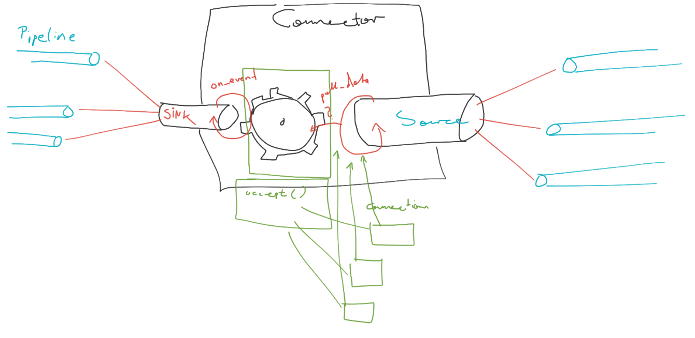

:sectnums:

:repr-c: pass:quotes[`#[repr\(C)]`]

Welcome to the second article of my
https://nullderef.com/series/rust-plugins/["`Plugins in Rust`" series]! Here I
will try to actually write some simple code of what a plugin system might look
like, and try to answer any questions that may arise while doing so.

Even though the project is specific to https://www.tremor.rs/[Tremor], I try to
keep it relatively generic so that it's useful to future rustaceans interested
in plugin systems. So if you don't really care about Tremor's specific case, you
can skip to the <<actual_start,next section>>.

== About Tremor

=== Getting to know the team

My first official meeting with the Tremor team took place in the beginnings of
August. I had already been lurking in their Discord server before, and I had
talked with them a few times, so I more or less knew what to expect. But I was
still surprised by their welcomingness and how refreshing their dynamics were.

Starting to work on Tremor for the first time with such a large task at first
sounds daunting. I was somewhat overwhelmed by that and felt quite some pressure
on me. But their words helped me de-stress about it; finishing the project would
of course be hard, but no need to worry about things you can't control yet.

I particularly liked the three "`rules`" of their workflow:

* Have fun
* Take good notes
* Don't worry

My mentors were Matthias, Darach, and Heinz. They seemed like very different
kinds of people; something they knew and took advantage of. Decision-taking is
hard; it requires good communication and an open mind. I also took note of this
quote (roughly) from them:

[quote, Darach]
____
When I have an idea about something, I just post it on the Discord server and
wait for it to be destroyed by someone else. If it doesn't, maybe it's worth
considering.
____

Also note that while writing this post I quite literally broke my leg (tibia &
fibula). The team was very supportive, and I took some rest until I went through
surgery. Which is another reason as to why this article has taken me longer than
usual to release. Thanks a lot to all of them ❤️.

=== Getting to know other mentees

In the first reunion I was suggested to meet the other LFX mentee at that
moment, @aryan9600 on Discord, which seemed like a good idea. I'd seen him a
couple of times and knew he'd been contributing to Tremor even before the
mentorship.

Aryan turned out to be a very nice colleague! He was very enthusiastic about the
project, and he explained me his progress in detail. In summary, he was starting
to add gRPC support to Tremor, and wasn't sure how to approach it so that new
interfaces could be added outside the compilation time. He had multiple ideas on
how to implement this, but the one that interested me the most was via Wasm or
dynamic linking, which was exactly what I was trying to do as well for the
system. This meant I'd probably spend more time with him, as our projects were
more interconnected than I thought.

=== Learning about the internals of Tremor

I've always known that the original intent for the system was the typical
architecture via dynamic linking, but I wanted to explore the viability of Wasm
or other alternatives before ruling it out. Would this idea be destroyed by
someone in the end, or does it stand a chance? In order to know that I'd first
need to find more specific requisites by defining the basic interfaces of the
system. Which is very hard at first because you need to know more about the
internals of Tremor and how it works.

Luckily, Matthias spent the second meeting explaining to me how Tremor works,
with the help of some drawings, taking a look at the code, and running it. He
also taught me the novel concept of a _connector_, which is just an abstraction
over both sources and sinks. The thing was that connectors were still Work In
Progress, and Matthias needed to know how the system would work to modify the
`Connector` interface. Mainly how to combine plugins and generics, which is what
I'll try to figure out in this article.

Back when I talked to Aryan we ended up asking ourselves the same exact things.
Turns out that the generated code with `tonic` for gRPC uses generics, which
might not be compatible with dynamic loading.

[[actual_start]]
== The first steps

Up until now I had mostly investigated about the
https://nullderef.com/blog/plugin-tech/[technologies] that could be used for the
system, but I was suggested that I should first take a look at how the interfaces
would actually look like. That way it would be easier to take the final decision
for the system's technology, according to the requirements for these interfaces. In
summary, the following questions arose:

* What's the performance hit of the system?
* Can we avoid serialization?
* Is it possible to use generics in the system?
* Otherwise, is it possible to use `dyn` in the system?
* If all else fails, what can be done to represent a "`generic`" trait object in
  the interface Tremor exports for plugins?

This meant I had to do more research. I spent a few days reading different
articles and forum discussions, but it's a rabbit hole 🐰! A few links I
recommend checking out:

* https://fasterthanli.me/articles/so-you-want-to-live-reload-rust[So you want
  to live-reload Rust -- fasterthanli.me]
* https://adventures.michaelfbryan.com/posts/wasm-as-a-platform-for-abstraction/[WebAssembly
  as a Platform for Abstraction -- adventures.michaelfbryan.com], recommended to
  me by Aryan
* https://adventures.michaelfbryan.com/posts/ffi-safe-polymorphism-in-rust/[FFI-Safe
  Polymorphism: Thin Trait Objects -- adventures.michaelfbryan.com]

Michael F. Bryan has put a lot of effort into teaching how dynamic loading and
Wasm work in Rust. Thanks a lot to him!

== Experimenting with dynamic loading

=== ABI unstability, it's much worse than it seems

I recently had this very late realization about ABI stability in Rust. Up until
this point I thought that even though Rust's ABI is _unstable_, one could
dynamically load a library safely as long as both the library and the main
binary were compiled with the same exact compiler/`std`/etc version. I had read
this many times in forums like
https://www.reddit.com/r/rust/comments/6v29z0/plugin_system_with_api/dlx9w7v/[this
one on Reddit] and in blogposts such as
https://adventures.michaelfbryan.com/posts/plugins-in-rust/["Plugins in Rust"],
so I assumed it was true.

But turns out that the ABI may not only break between compiler versions, but
also _compiler runs_. `rustc` doesn't guarantee that a layout is going to be the
same in different executions. This is proved by
https://github.com/rust-lang/compiler-team/issues/457[rust-lang/compiler-team#457],
the new unstable `-Z randomize-layout` flag. It's pretty much self-explanatory:
it randomly reorders `repr(rust)` layouts for testing purposes. The same thing
could happen in the future without an explicit flag; an optimization may cause
the `repr(rust)` layouts to change between compilation runs. It's briefly
mentioned in
https://doc.rust-lang.org/reference/type-layout.html#type-layout[the Rust
reference] as well:

____
Type layout can be changed with each compilation. Instead of trying to document
exactly what is done, we only document what is guaranteed today.
____

Props to the devs at the `#black-magic` channel in
https://discord.com/invite/rust[Rust's Discord server], who helped me understand
this. Specially Yandros and Kixiron, both of them very respectable contributors
to the Rust compiler/community.

This basically means that we are _forced_ to stick to the C ABI with {repr-c},
and that we should use  in order to have access to a
stable `std` library as well, instead of re-implementing everything ourselves
from scratch. On the positive side, it means that plugins could be implemented
in any language, but that wasn't important for Tremor's case since the beginning
anyway.

=== Getting a simple example running

I've created the
https://github.com/marioortizmanero/pdk-experiments[pdk-experiments] repository,
where I'll write various examples of how the plugin system might work. The first
experiment is in the
https://github.com/marioortizmanero/pdk-experiments/tree/master/dynamic-simple[`dynamic-simple`
directory], with a small example of how to dynamically load plugins with Rust.

We first need a crate called `common`, which defines the interface shared by the
plugin and the runtime in the main binary. In this case it's just a pointer to a
function with the C ABI. We can specify the ABI with `extern "C"`, or simply
`extern`, as `"C"` is already its default value <<extern>>. To keep it simple
it'll just compute the minimum between two integers:

.`common/src/lib.rs`

pub type MinFunction = unsafe extern fn(i32, i32) -> i32;


With it, the plugin crate may export its own implementation. In this case I'll
declare a `static` variable, but the example showcases how `extern` may work as
well. Since we want to use the C ABI, we'll have to specify `crate-type` as
`cdylib` in our `Cargo.toml`. Note that `#[no_mangle]` is necessary so that the
variable's name isn't https://en.wikipedia.org/wiki/Name_mangling[_mangled_] and
we can access it when dynamically loading the library.

.`plugin-sample/src/lib.rs`

#[no_mangle]
pub static with_static: MinFunction = min;

pub extern fn min(a: i32, b: i32) -> i32 {
    a.min(b)
}


Finally, the main binary can load the library with ,
which requires a bit of `unsafe`. I was looking forward to using a different
library because of how easy it seems to end up with undefined behaviour in that
case. I found out  was abandoned, as no commits had been
made since 2017, leaving  as the only alternative. Which was
updated two years ago as well, but their GitHub repo seemed somewhat active in
comparison.

For now, I'll just use `libloading` for being the most popular crate, and
perhaps I'll consider using `dlopen` in the future. In terms of relevant
features and performance they're pretty close anyway <<dynload-comp>>. Here's
what the code looks like:

.`src/main.rs`

fn run_plugin(path: &str) -> Result<(), libloading::Error> {
    unsafe {
        let library = Library::new(path)?;
        let min = library.get::<*mut MinFunction>(b"plugin_function\0")?.read();
        println!("Running plugin:");
        println!("  min(1, 2): {}", min(1, 2));
        println!("  min(-10, 10): {}", min(-10, 10));
        println!("  min(2000, 2000): {}", min(2000, 2000));
    }

    Ok(())
}


We can run it with the following commands (though the `Makefile` in the repo
will do everything for you):


$ cd plugin-sample
$ cargo build --release
$ cd ..
$ cargo run --release -- plugin-sample/target/release/libplugin_sample.so
Running plugin:
  min(1, 2): 1
  min(-10, 10): -10
  min(2000, 2000): 2000


Cool! This raises a few questions that I should learn more about:

. Since we're using the C ABI, is it perhaps best to declare the bindings in C?
  The `common` crate I introduced earlier could just be a header.
. There are many options to configure `crate-type` as a
  https://doc.rust-lang.org/reference/linkage.html[dynamic library]. What are
  they and which one should I choose?
. I faintly remember that `rlib` files are Rust-only objects with additional
  metadata for things like generics. Could that possibly work at runtime? As in,
  is there an equivalent to
  https://en.wikipedia.org/wiki/Component_Object_Model[COM] in Rust, or maybe
  like JAR files in Java?

=== Generating bindings

The public interface for the plugins can be written either in Rust (thanks to
`extern "C"`) or directly in C. There are two commonly used projects when
writing bindings:

* https://rust-lang.github.io/rust-bindgen/[`rust-bindgen`] generates Rust
  bindings from C code
* https://github.com/eqrion/cbindgen[`cbindgen`] is the opposite; it generates C
  bindings from Rust code.

Some examples of its usage:

*  is a crate completely written in Rust that exposes C
  headers for compatibility, so it uses `cbindgen` to generate them
  automatically.
*  exposes the interface of
  https://pipewire.org/[PipeWire], written in C, so that it's also available
  from Rust, thanks to `rust-bindgen`.

Since we're going to write the plugin system in Rust, the most appropiate choice
would be to use Rust for the interface as well. And if we wanted to make the
plugin interface available to other languages -- which is not a concern right
now -- it'd be as "`easy`" as setting up `cbindgen`.

=== `crate-type` values

There are https://doc.rust-lang.org/reference/linkage.html[two ways to configure
dynamic linking with the `crate-type` field] in the crate's `Cargo.toml`:

* `dylib`
* `cdylib`

Once again, this difference has to do with the ABIs in the dynamic library
<<dylib>>. `cdylib` is meant for linking into C/C++ programs (so it strips away
all functions that aren't publicly exported), and `dylib` is meant for Rust
libraries.

When compiling the previous example with `dylib`, the resulting shared object
for the plugin has a size of 4.8Mb, whereas with `cdylib` it's just 2.9Mb. So
while both of these will work for our C ABI, `cdylib` is clearly the more
appropiate choice.

=== `rlib` files

`rlib` is another value for `crate-type` to generate Rust *static* libraries,
which can then be imported with `extern crate crate_name` <<dylib>>. But since
`rlib` files are static libraries, they can't be loaded at runtime, so they're
of no use in a plugin system.

Here's a crazy idea though: What if the `rlib` files were dynamically loaded as
plugins with the help of https://github.com/rust-lang/miri[MIRI]? I recently
learned about it, and quoting its official documentation:

[quote]
____
[MIRI is] an experimental interpreter for Rust's mid-level intermediate
representation (MIR). It can run binaries and test suites of cargo projects and
detect certain classes of undefined behavior.

#You can use Miri to emulate programs on other targets#, e.g., to ensure that
byte-level data manipulation works correctly both on little-endian and
big-endian systems.
____

Hmm. Could it possibly be used to interpret Rust code? In some way this would be
very similar to using WebAssembly, but theoretically with less friction, as MIR
is specific to Rust and plugin development would be as easy as in the case of
dynamic loading with Rust-to-Rust FFI. A few things to consider:

. *Is this even possible?*
+
The Rust compiler itself uses MIRI to evaluate constant expressions
<<miri-compiler>> via the
https://doc.rust-lang.org/nightly/nightly-rustc/rustc_mir/index.html[`rustc_mir`
crate]. But taking a quick look it seems to be created specifically for the
compiler, at a very low level, and without that much documentation. Plus, it's
nightly-only. It does seem possible, but I wasn't able to get a simple example
working.
. *Is MIR stable?*
+
MIR is unfortunately unstable <<miri-unstable>>, so we'd have the same
incompatibility problems between plugins and the main binary.
. *Is the overhead of MIRI worth it?*
+
Considering the previous answers, no, but it was cool to consider and learn
about :)

== Can we use WebAssembly for this?

I also tried to write a simple example of how plugins would work with
WebAssembly. They are available in the
https://github.com/marioortizmanero/pdk-experiments/tree/master/wasmer-simple[`wasmer-simple`]
and
https://github.com/marioortizmanero/pdk-experiments/tree/master/wasmtime-simple[`wasmtime-simple`]
directories. It took me considerably more effort to understand and get running
than with dynamic linking, even following
https://freemasen.com/blog/wasmer-plugin-pt-1/[Free Masen's guide] and
https://docs.rs/wasmer[Wasmer's official documentation]. But at least I didn't
have to write that much `unsafe` (it's still needed to load or store data from
Wasm's virtual memory, which I'll explain later on).

The following snippet is what the plugin would look like. Note that this time we
use `pub` without even considering `static` to export a pointer to the function.
Wasm does have support for globals, but since handling complex types -- those
other than numbers, a function in this case -- isn't trivial, it's not worth it.

.`plugin-sample/src/lib.rs`

#[no_mangle]
pub fn with_extern(a: i32, b: i32) -> i32 {
    a.min(b)
}


For the runtime, since it's a simple example I'll try both
https://wasmer.io/[Wasmer] and https://wasmtime.dev/[Wasmtime]. For more complex
things I'll just use Wasmer, since in an
https://nullderef.com/blog/plugin-tech/[earlier post] it seemed like the best
alternative. I also wanted to try
https://github.com/alec-deason/wasm_plugin[`wasm_plugin`], which includes
procedural macros to help reduce the overall boilerplate (which will be more
important later on), but it seems to be abandoned since 2019. It's interesting
to try the lower-level interface of the runtimes myself to learn more about it
anyway, so I'll just use that for now. If we ended up using Wasm for Tremor I'd
try updating and maintaining `wasm_plugin` to keep the code boilerplate-free.

.Wasmer, in `src/main.rs`

pub fn run_plugin(path: &str) -> Result<(), Box<dyn Error>> {
    // For reference, Feather also reads the plugins with `fs::read`:
    // https://github.com/feather-rs/feather/blob/07c64678f80ff77be3dbd3d99fbe5558b4e72c97/quill/cargo-quill/src/main.rs#L107
    let module_wat = fs::read(&path)?;
    let store = Store::default();
    let module = Module::new(&store, &module_wat)?;
    let import_object = imports! {};
    let instance = Instance::new(&module, &import_object)?;

    println!("Running plugin:");
    let min_extern: NativeFunc<(i32, i32), i32> = instance.exports.get_native_function("with_extern")?;
    println!("  min(1, 2): {}", min_extern.call(1, 2)?);
    println!("  min(-10, 10): {}", min_extern.call(-10, 10)?);
    println!("  min(2000, 2000): {}", min_extern.call(2000, 2000)?);

    Ok(())
}


.Wasmtime, in `src/main.rs`

pub fn run_plugin(path: &str) -> Result<(), Box<dyn Error>> {
    let engine = Engine::default();
    let module = Module::from_file(&engine, &path)?;
    let mut store = Store::new(
        &engine,
        WasmState {},
    );
    let imports = [];
    let instance = Instance::new(&mut store, &module, &imports)?;

    println!("Running plugin:");
    let min_extern = instance.get_typed_func::<(i32, i32), i32, _>(&mut store, "with_extern")?;
    println!("  min(1, 2): {}", min_extern.call(&mut store, (1, 2))?);
    println!("  min(-10, 10): {}", min_extern.call(&mut store, (-10, 10))?);
    println!("  min(2000, 2000): {}", min_extern.call(&mut store, (2000, 2000))?);

    Ok(())
}


For a simple example they're pretty much the same. Running them:


$ rustup target add wasm32-wasi
$ cd plugin-simple
$ cargo build --target wasm32-wasi --release
$ cd ..
$ cargo run --release -- plugin-sample/target/wasm32-wasi/release/plugin_sample.wasm
Running plugin:
  min(1, 2): 1
  min(-10, 10): -10
  min(2000, 2000): 2000


* AFAIK Rust has multiple compilation targets for Wasm. Which one should I be
  using?
* What's the difference between the https://docs.rs/wasmer/[`wasmer`] crate and
  https://docs.rs/wasmer-runtime/[`wasmer_runtime`]?
* What about exporting types more complex than an `i32`? Is it possible to
  export a struct that implements a specific trait?

=== WebAssembly targets

Wasmer docs don't mention this much because targets are related to the plugin,
rather than the runtime. But Wasmtime's book does include a section about
compiling Rust to WebAssembly:

[quote, https://docs.wasmtime.dev/wasm-rust.html]
____
* `wasm32-wasi` - when using wasmtime this is likely what you'll be using. The
  WASI target is integrated into the standard library and is intended on
  producing standalone binaries.
* `wasm32-unknown-unknown` - this target, like the WASI one, is focused on
  producing single *.wasm binaries. The standard library, however, is largely
  stubbed out since the "unknown" part of the target means libstd can't assume
  anything. This means that while binaries will likely work in wasmtime, common
  conveniences like println! or panic! won't work.
* `wasm32-unknown-emscripten` - this target is intended to work in a web browser
  and produces a *.wasm file coupled with a *.js file, and it is not compatible
  with wasmtime.
____

So basically what we need is `wasm32-wasi`. By the way, even though Wasmer was
my initial choice, to be honest I found Wasmtime's docs to be much more detailed
and well-organized.

=== `wasmer` vs `wasmer_runtime`

This was confusing for me at first, since both crates seem to have a very
similar interface and almost the same set of authors. Some tutorials used
`wasmer`, others `wasmer_runtime`.

The difference seems to be that `wasmer_runtime` was updated about a year ago,
while `wasmer` got bumped to v2.0.0 just two months ago. The last release of
`wasmer_runtime` is v0.17 (v0.18 seems to be yanked), and the first one of
`wasmer` is v0.17 as well, so my bet is that `wasmer_runtime` is the name of the
crate their team used previously, and they eventually deprecated it in favor of
`wasmer`.

I've opened an https://github.com/wasmerio/wasmer/issues/2539[issue] upstream so
that this is hopefully more clear to future users.

=== More complex types

The WebAssembly specification only defines integers and floating point as its
supported types <<wasmer-types>>. There are a few ways to handle non-trivial
types like structs or enums:

==== The Interface Types Proposal

https://github.com/webassembly/interface-types[This proposal for WebAssembly]
defines the binary format for encoding and decoding the newly supported types,
and specifies a set of instructions to transform the data between WebAssembly
and the outside world. Note that this proposal is not meant to define a fixed
representation of e.g., a string in Wasm, it attempts to allow
representation-agnostic high-level value types.

These new _high-level value types_ are called *interface types*. The current
proposal defines them as:

* Floating point of 32 and 64 bits
* Signed and unsigned integers of up to 64 bits
* Single characters
* Lists (a string would be a list of characters)
* Records (basically like Rust structs)
* Variants (basically like Rust enums or unions, it would enable `Option`,
  `Result`, etc)

Additionally, language-neutral interfaces for WASI can be defined with the
experimental *`witx` files* <<witx>>, which makes it easy to define a common ABI
in order to interact from different programming languages <<witx-example>>
<<witx-guide>>. They look like this:


(use "errno.witx")

;;; Add two integers
(module $calculator
  (@interface func (export "add")
    (param $lh s32)
    (param $rh s32)
    (result $error $errno)
    (result $res s32)
  )
)


Please refer to the
https://github.com/WebAssembly/interface-types/blob/master/proposals/interface-types/Explainer.md[proposal
itself] for more detailed information; it's very well explained.

The main problem is that this proposal is still at
https://github.com/WebAssembly/proposals#phase-1---feature-proposal-cg[Phase 1].
It's still actively being worked on, and its specification is far from stable.

* At the plugin level the  crate seems to be ideal,
  and it already works well. It's a very simple procedural macro that can be
  added to the exported functions in the plugin in order to automatically add
  support for Interface Types.
* The  crate can be used to generate Rust code from `witx`
  files. For the previous snippet of code, wiggle's macro will generate a
  `Calculator` trait and the defined types in another module named `types`.
* The runtimes, however, don't work with Interface types:
** Wasmtime did support this in the past until their implementation was removed
   after being considered outdated. As
   https://github.com/bytecodealliance/wasmtime/issues/677[this issue
   indicates], it still hasn't been updated.
** Wasmer has the
   https://docs.rs/wasmer-interface-types/[`wasmer_interface_types`] crate, but
   with a similar story; it's outdated. There's
   https://github.com/wasmerio/wasmer/issues/2480[this issue] as a continuation
   of Wasmtime's, which explains the situation.

In the end I wasn't able to get Interface Types working, nor I considered them
worth my time, as it's still too early.

==== The hacky-but-working way

Via pointers and a shared
https://docs.wasmer.io/integrations/examples/memory[memory]. The user has to
first construct and serialize the complex types, and then save them into Wasm's
memory, which can be accessed directly by the runtime or the plugin with
https://docs.wasmer.io/integrations/examples/memory-pointers[pointers]. This is
what https://github.com/feather-rs/feather/tree/main/quill[Feather] or
https://book.veloren.net/contributors/developers/codebase-structure.html#plugins[Veloren]
do, in case you want more details.

Not only does this require a serialization and deserialization step and
writing/reading all the data from memory, but also it's very cumbersome to use
and easy to mess up. It's somewhat trivial though, so a procedural macro like
the now outdated  could simplify it. For now,  can be used for the serialization steps manually.

I did try this and got it working by following
https://freemasen.com/blog/wasmer-plugin-pt-1/[Free Masen's guide], but it
wasn't worth exploring in depth because it requires a [de]serialization step
Tremor can't afford.

==== Separate executables

Another way I've seen to work around this is by using Wasm as an executable
instead of a library. https://github.com/zellij-org/zellij[Zellij] does this,
and communicates with the plugins via the standard input and standard output
streams.

Unfortunately, this also requires [de]serializing and has the overhead of
writing/reading all the data from stdin and stdout.

==== Conclusion

Ultimately, this has forced me to discard WebAssembly for Tremor's Plugin
Development Kit. Performance is really important in this specific case, and Wasm
doesn't offer a solution to efficiently pass data between the host and the
plugin. For most use cases Wasm still may be of interest, so hopefully I've
included enough links and ideas so that you can get started if it's the way you
want to go.

== Wrapping up

Today we've learned a lot of things both about dynamic loading and WebAssembly.
Unfortunately, I've had to discard the latter for Tremor's case, but it may be
of interest to projects that aren't so focused on performance. Or maybe by the
time you, the reader, have finished this article, the issues I found are already
stabilized and broadly used, which would make Wasm an even more appealing
choice.

In the next post, I will try to get a more advanced example of a plugin system
with dynamic loading. The goal is to simulate the end-product by writing it as
close as possible to how it would be used in real life. This way, we will also
be able to benchmark it against a statically linked implementation and analyze
the performance overhead we'll end up getting.

I did write a few benchmarks for the examples provided in this article, but they
aren't fair at all nor representative of a real-life situation. They simply load
the plugin and run the `min` function once, or in the case of dynamic loading
twice (one with `static` and another with `extern`). And since they're very
simple examples, the Wasm ones don't include the [de]serialization part that may
introduce even more overhead. Knowing that, the results are the following, which
is more or less what I was expecting:


test test::dynamic_simple ... bench:     139,702 ns/iter (+/- 34,699)
test test::wasmer_setup   ... bench:     967,633 ns/iter (+/- 203,933)
test test::wasmtime_setup ... bench:     988,500 ns/iter (+/- 363,244)


I hope you enjoyed reading this post and that you learned something from it! You
can leave any suggestions in the comments below.

[bibliography]
== References

- [[[extern,          1]]]
  https://doc.rust-lang.org/std/keyword.extern.html[Keyword extern --
  doc.rust-lang.org]
- [[[dynload-comp,    2]]]
  https://github.com/szymonwieloch/rust-dlopen#compare-with-other-libraries[Compare
  with other libraries --  GitHub szymonwieloch/rust-dlopen]
- [[[dylib,           3]]]
  https://users.rust-lang.org/t/what-is-the-difference-between-dylib-and-cdylib/28847[What
  is the Difference Between `dylib` and `cdylib` -- users.rust-lang.org]
- [[[miri-compiler,   4]]] https://rustc-dev-guide.rust-lang.org/miri.html[Miri
  -- Guide to Rustc Development]
- [[[miri-unstable,   5]]]
  https://github.com/rust-lang/miri/blob/master/CONTRIBUTING.md#preparing-the-build-environment[Preparing
  the build environment -- Github rust-lang/miri]
- [[[wasmer-types,    6]]]
  https://docs.rs/wasmer-runtime-core/0.17.1/wasmer_runtime_core/types/trait.WasmExternType.html[`WasmExternType`
  -- Wasmer v0.17.1]
- [[[wasmtime-inttyp, 7]]]
  
- [[[witx,            8]]]
  https://github.com/WebAssembly/WASI/blob/main/tools/witx-docs.md[Know your
  `witx` -- GitHub WebAssembly/WASI]
- [[[witx-example,    9]]]
  https://github.com/WebAssembly/interface-types/blob/master/proposals/interface-types/Explainer.md#defining-language-neutral-interfaces-like-wasi-revisited[Defining
  language-neutral interfaces like WASI (revisited) --
  GitHub WebAssembly/interface-types]
- [[[witx-guide,     10]]] https://radu-matei.com/blog/wasm-api-witx/[Writing a
  simple WASM API layer using interface types and Wasmtime -- radu's blog]
