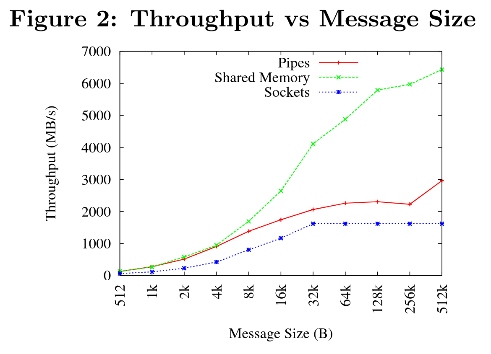
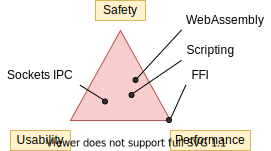

Welcome to the ["Plugins in Rust" series](https://nullderef.com/series/rust-plugins/)! During the next months I'll be involved in a project with [Tremor](https://www.tremor.rs/), for which I need to implement a Plugin System. The goal is to maximize modularity and reduce Rust’s wild compilation times. The implementation will end up being done with dynamic loading, but I will cover all the alternatives first to make sure it's the best approach for my use-case.

In this first article I will analyze the different ways in which our plugin system may be implemented in Rust. Note that I'm no expert in the topic; my objective is to merely collect all the information I've found so far and present it as a summary, with enough resources for the reader to learn more on their own and make their own decisions.

## The Problem

This is actually part of my [Google Summer of Code](https://summerofcode.withgoogle.com/) project for [Tremor](https://www.tremor.rs/). While this will specifically cover Tremor's use case, I'm sure many other applications in the future will have similar requirements for their own program. And considering the few articles I found about plugins in Rust, this [series](https://nullderef.com/series/rust-plugins/) may be helpful to the community.

***NOTE**: Google didn't end up allocating a slot for me in the GSoC, but I'll still be able to continue through [a LFX Mentorship](https://mentorship.lfx.linuxfoundation.org/project/b90f7174-fc53-40bc-b9e2-9905f88c38ff).*

After showing the proposal to the Tremor team, I was given an important suggestion: in this case there isn't really a need to be able to write plugins from multiple programming languages; it's not worth the additional complexity. It would definitely be interesting but with this I can focus on the main problems I discovered in my proposal: the ABI instability, and safety.

Besides that, the rest of the main points to consider remain the same:

1. **Mandatory:** Being able to load/unload the plugins both at start-time and at run-time.
2. **Mandatory:** Cross-platform support
3. **Mandatory:** Low overhead
4. **Mandatory:** Available at least from Rust
5. **Extra:** [Safety](#safety)
6. **Extra:** [Backwards compatibility](#back-comp)
7. **Extra**: Not much work to port from the existing implementations

## Safety Concerns

I've been wanting to take a look at the possible safety concerns a plugin system could bring to Tremor since the initial proposal.

***NOTE**: Depending on the approach that is taken for the Plugin System, implementing solutions to some of the points I make below can be really complex, so I wouldn't work on them for the initial deadline. For now, it's something we have to be aware of.*

### Unsafe Code

Many of the technologies that can be used to implement a Plugin System work with unsafe code, like [FFIs](#ffi) or [IPC Memory Sharing](#memory-sharing). This isn't necessarily a problem if it's self-contained and thoroughly reviewed, but we lose some safety guarantees provided by Rust, increasing the maintenance cost of the library.

It takes considerably more work to make sure the implementation is sound, even with tools like [MIRI](https://github.com/rust-lang/miri), which I plan on integrating into Tremor if I do end up having to use `unsafe`.

### Error Resilience

Rust doesn't protect its users from leaking memory. In fact, it's as easy as calling `mem::forget`. The thing is that if a plugin leaks memory, the entire process also does, meaning that Tremor's performance could be affected by incorrectly developed plugins.

This doesn't happen just with memory leaks; a plugin could abort or panic and crash the entire thing very easily.

Ideally, Tremor could detect plugins that aren't performing well and stop them before it's too late. The core of the program could continue running even when a plugin fails, and perhaps warn the user about its malfunctioning, for optimal error resilience.

### Remote Code Execution via Plugins

[This was a problem with Internet Explorer](https://en.wikipedia.org/wiki/Component_Object_Model#Security), for example. It used COM and ActiveX, which implemented no sandboxing at all and were running directly on the user's machine, allowing malware to be included in plugins with the ability to execute arbitrary code on the host machine. This can be less of a problem when installing only trusted plugins via digital signatures, but it's still a huge risk.

In the case of Tremor plugins this is a similar problem. The end user --- those who will add plugins to their configuration --- is a developer, who should be more wary of what they're including in their own projects. But the truth is that it isn't any better.

I would compare the situation more specifically to how package managers like [npm](https://www.npmjs.com/) work (or anything that deals with dependencies, really). The entire infrastructure is usually based on trust; noone's really stopping you from uploading a malicious package/crate for remote code execution or to steal data[^npm-trust-1][^npm-trust-2]. Plugins are like dependencies in this case; they have full access to the host's computer, and thus shouldn't be trusted by default.

An improved approach to Node + npm would be something like [Deno](https://github.com/denoland/deno), which is a secure by default JavaScript/TypeScript runtime. This is enabled thanks to sandboxing, and requires the developer to manually toggle, e.g., access to the filesystem or to the network. This is no panacea because people might end up enabling whatever permission is required by the dependency they want to install without thinking about it, but it's similar to `unsafe`: at least it makes you aware that you might mess up.

One could argue that their program is realistically going to be running in a Virtual Machine or a container most of the times, where this may not matter so much. But should you really assume that? Should user safety rely on the fact that the machine is running on an isolated kernel? Containers, by the way, introduce a much bigger overhead in comparison to some sandboxing methods. And even if the system as a whole is isolated, there is still a possibility for internal leaks: the Postgres plugin has access to whatever is being used by the Apache Kafka plugin, which may have sensitive logs you don't want anyone to see.

## Backward Compatibility

There needs to be some kind of version handling within this project. The core of Tremor may change with frequency, which will break plugins based on previous versions. If the plugin receives a struct from the core, but the struct had one of its members removed in a new version, it will result in undefiend behaviour.

### Possible Solutions

The easiest fix for backward compatibility issues I can come up with is to serialize and deserialize the data with a flexible protocol rather than using its binary representation directly. If something like JSON is used to communicate between the core and its plugins, adding a field to a message won't break anything, and removing one can be done via a deprecation process. Unfortunately, this introduces some overhead the application may not be interested in.

Other more involved methods for binary representations include[^swift-abi]:

* Reserving space in the struct for future use.
* Making the struct an opaque type, requiring function calls to get the fields.
* Giving the struct a pointer to its "version 2" data (opaque in "version 1").

### Avoiding Breakage

There are times when breakage is inevitable. Tremor may want to rewrite part of its interface or finally remove a deprecated feature without being afraid of breaking all the plugins previously developed.

For that, the plugins must embed a bit of metadata about the different versions of rustc/interface/etc it was developed for. Then, when it's loaded by Tremor, it may check if they're compatible, rather than breaking in mysterious ways.

## Possible Approaches

The following are the most viable technologies that could be used as the base of the system. Some of them won't match the requirements I mentioned earlier at first glance, but it's a good idea to at least _consider_ all of them. I haven't written a line of code yet, so if an approach were to catch someone's eye we could investigate more about it. I will rate each of the alternatives in a scale from 1 to 5 (approximately) in order to easen the decision-taking.

### Scripting Languages

Plenty of projects use scripting languages to extend their functionality at runtime, like Python, Ruby, Perl, Bash, or JavaScript. Most notably, Vim created its own scripting language, Vimscript, in order to be fully customizable, and NeoVim is now pushing [Lua](https://www.lua.org/) as a first-class language for configuration. Even Tremor itself has the interpreted query language [Troy](https://www.tremor.rs/docs/language/) for configuration.

Lua is seen in game development; it's a quite simple language with a very performant JIT implementation, which in any case I think would be the best option here. It could be embedded into our runtime (it's only 281 kB compiled![^lua-wiki]) and used to load plugins at either start-time or run-time. And knowing it's used in games, which are _obsessed_ with performance, it might not be that much of a big deal in that regard.

***NOTE**: There are [languages specifically designed to extend Rust's capabilities](https://arewegameyet.rs/ecosystem/scripting/), which you might be interested in, but I'll just simplify this part by going for Lua.*

Rust has libraries like [`rlua`](https://github.com/amethyst/rlua) which provide bindings for interoperability with Lua. `rlua` in particular seems to focus on having an idiomatic and safe interface, which is rare for a bindings library and good news, though it seems to be currently semi-abandoned, and forked by [`mlua`](https://github.com/khvzak/mlua). Unfortunately, after digging a bit the Rust ecosystem for Lua bindings doesn't seem to be as mature as I'd like for a project this big; there's still some work to do to reach more stability.

Lua gets extra points in safety. It's possible to sandbox it by blocking whichever functions you don't want users to access[^lua-sandbox] (though it's "tricky and generally speaking difficult to get right"). Similarly, one can also handle resource exhaustion issues within Lua programs. Not to mention that this wouldn't require `unsafe` at all with an optimal set of bindings.

Anyhow, the main deal-breaker with scripting languages in this case is that it would be extremely complicated to port everything in Tremor so that it can be used from Lua. For new projects this could perhaps be something interesting, but not if the entirety of the already existing plugins have to be rewritten.

Still, it's a pretty interesting option for new projects, as you have ABI stability guarantees, solid safety overall, and it's very straightforward to use.

1. <strong class="green white-background txt-margin-right txt-round">5/5</strong> **Cross-platform support**
2. <strong class="green white-background txt-margin-right txt-round">4/5</strong> **Low overhead**
3. <strong class="olive white-background txt-margin-right txt-round">3/5</strong> **Rust availability**
4. <strong class="green white-background txt-margin-right txt-round">5/5</strong> **Safety**
5. <strong class="green white-background txt-margin-right txt-round">5/5</strong> **Backwards compatibility**
6. <strong class="red white-background txt-margin-right txt-round">0/5</strong> **Ease of porting existing implementations**

### Inter-Process Communication

Another possibility for plugins is to define a protocol for Inter-Process Communication, turning your program into a server that extends its capabilities by connecting to external plugins. For instance, most text editors use this method to support the [Language Server Protocol](https://microsoft.github.io/language-server-protocol/), which uses JSON-RPC.

There are of course multiple ways to do IPC, which I'll briefly list below. Performance-wise, this graph shows a comparison of the overhead of each of them[^ipc-wisc]:

#### Based on Sockets

Sockets are the "worst"-performing alternative in the previous chart, but they're so common and easy to use in most languages that it's worth taking a look at. Using relatively lightweight protocols like [Protocol Buffers](https://developers.google.com/protocol-buffers), the performance would be close to passing raw structs, but with improved backwards/forwards compatibility[^protobuf-perf]. JSON would probably not make that big of a difference in terms of performance either. This would make it possible to write a plugin in any language as well --- including Rust --- as long as there's an implementation of the protocol available. But there's still noticeable overhead when communicating via sockets; sending and receiving the messages can be much costlier than just calling a function, even if this happens on localhost.

This alternative is much more interesting than [Scripting Languages](#scripting-langs) for Tremor's specific case: we don't have to completely rewrite everything, since Rust can still be used, and implementing the protocol to communicate between the Tremor core and its plugins should be as easy as `#[derive(Serialize)]` for sending and `#[derive(Deserialize)]` for receiving.

As to safety, separate processes imply that malfunctioning plugins don't affect Tremor directly, and the system basically consists on implementing servers, which require no `unsafe` at all and has much more popularity and support in Rust. It's still hard to properly sandbox the plugins, though.

Overall, I consider this a very solid solution, with its main drawback being performance. I can't really guess the effect this would have in Tremor's speed, so I would love to create a quick benchmark when I get to implement the first prototypes to see if it's actually the best choice, if Tremor devs think it's worth my time.

1. <strong class="green white-background txt-margin-right txt-round">5/5</strong> **Cross-platform support**
2. <strong class="olive white-background txt-margin-right txt-round">3/5</strong> **Low overhead**
3. <strong class="green white-background txt-margin-right txt-round">5/5</strong> **Rust availability**
4. <strong class="olive white-background txt-margin-right txt-round">3/5</strong> **Safety**
5. <strong class="green white-background txt-margin-right txt-round">5/5</strong> **Backwards compatibility**
6. <strong class="green white-background txt-margin-right txt-round">5/5</strong> **Ease of porting existing implementations**

#### Based on Pipes

Pipes have always been fairly popular specifically on Unix systems, and enable Inter-Process Communication with less overhead than sockets. They are made to be ran on the same machine, which is exactly what we need. The terminal file manager [nnn](https://github.com/jarun/nnn) uses this approach: plugins can read from a FIFO (Named Pipe) to receive selections from nnn (lists of files or directories) and act accordingly.

The rest is basically the same as with [Sockets](#sockets), maybe with extra points for performance, and less for Rust availability, since there don't seem to be any reliable libraries for pipes (maybe [`interprocess`](https://docs.rs/interprocess/1.1.1/interprocess/) or [`ipipe`](https://crates.io/crates/ipipe)). But really, are libraries necessary at all? The `std` library [has support for cross-platform pipes when executing external commands](https://doc.rust-lang.org/rust-by-example/std_misc/process/pipe.html) for stdin, stdout, and stderr, which most times is enough. The plugin can just use stdin to receive messages and stdout to send them. If that's enough for your case then it's vastly simplified.

1. <strong class="green white-background txt-margin-right txt-round">5/5</strong> **Cross-platform support**
2. <strong class="green white-background txt-margin-right txt-round">4/5</strong> **Low overhead**
3. <strong class="green white-background txt-margin-right txt-round">4/5</strong> **Rust availability**
4. <strong class="olive white-background txt-margin-right txt-round">3/5</strong> **Safety**
5. <strong class="green white-background txt-margin-right txt-round">5/5</strong> **Backwards compatibility**
6. <strong class="green white-background txt-margin-right txt-round">5/5</strong> **Ease of porting existing implementations**

#### Based on Memory Sharing

Knowing that the plugins are intended to be on the same machine as the core of Tremor, there's no need to actually send and receive messages. One can share memory between multiple processes and send notifications to receive updates. The performance is comparable to using FFI, since the only overhead is the initial cost from setting up the shared pages, having regular memory access afterwards[^memory-share-so].

This feature heavily depends on the system's kernel, so it may hurt the "Cross-Compatibility" requirement. We have libraries like [`shared_memory`](https://docs.rs/shared_memory) + [`raw_sync`](https://docs.rs/raw_sync) in Rust that wrap all the OS implementations under the same interface, but admittedly, they don't seem anywhere near as popular as most of the other alternatives. Not to mention that the examples for `shared_memory` _do_ use `unsafe`, and a lot of it.

Maybe if it was easier to use this would be a good idea, but IPC shared memory doesn't seem to be any better than FFIs overall.

1. <strong class="green white-background txt-margin-right txt-round">5/5</strong> **Cross-platform support**
2. <strong class="green white-background txt-margin-right txt-round">5/5</strong> **Low overhead**
3. <strong class="red white-background txt-margin-right txt-round">2/5</strong> **Rust availability**
4. <strong class="red white-background txt-margin-right txt-round">2/5</strong> **Safety**
5. <strong class="olive white-background txt-margin-right txt-round">3/5</strong> **Backwards compatibility**
6. <strong class="green white-background txt-margin-right txt-round">5/5</strong> **Ease of porting existing implementations**

### Dynamic Loading

This is possibly the _least weird_ way to implement a Plugin Development Kit, i.e., it's the most popular method I've seen outside of Rust. A _Foreign Function Interface_ can allow us to directly access resources in separately compiled objects, even after the linking phase with dynamic loading. It's one of the fastest options available because there's no overhead at all after dynamically loading the library.

The main library for this is [`libloading`](https://github.com/nagisa/rust_libloading). There's also the less popular [`dlopen`](https://docs.rs/dlopen/0.1.8/dlopen/) and [`sharedlib`](https://github.com/Tyleo/sharedlib), with some small differences[^ffi-comparison]. It seems to be a lower-level implementation for any kind of FFI that requires `unsafe` for almost everything --- what I was expecting. Based on it there's [`dynamic_reload`](https://github.com/emoon/dynamic_reload), which is very interesting in order to "live reload" the plugins when they are recompiled. This would be useful for the development process of the plugins, since it also handles unloading the _same plugin_ seamlessly, but that's not a goal for this project, so I don't plan on using it. And the [`dlib`](https://github.com/vberger/dlib) crate provides macros to make the library loading simpler, based on `libloading`.

Creating an internal interface for Tremor through C is a lot of work. But it's unfortunately the only way to do it, since Rust-to-Rust FFI is not stable. It has awful safety by relying heavily on `unsafe` with plenty of caveats[^ffi-caveat-1][^ffi-caveat-2], including subtle differences between Operating Systems[^ffi-cross-platform] --- although `dlopen` seems to be better in that regard[^ffi-dlopen-safety]. Since it doesn't have a sandbox, plugins can abort Tremor's core execution when panicking/leaking memory/similars.

I recently discovered the [`abi_stable`](https://github.com/rodrimati1992/abi_stable_crates) crate, which guarantees stability in Rust's ABI unofficially and helps a lot with the binary compatibility aspect.

It includes FFI-safe alternatives to many of the types in the standard library, and even external ones (namely `crossbeam`, `parking_lot` and `serde_json`). This works by implementing a [`StableAbi`](https://docs.rs/abi_stable/*/abi_stable/abi_stability/stable_abi_trait/trait.StableAbi.html) trait that guarantees its FFI-safety, which may be done automatically with one of its procedural macros. Internal ABI stability is also guaranteed with macros like `#[sabi(last_prefix_field)]`, which would allow Tremor to add fields to existing structs [without breaking backwards compatibility](https://github.com/rodrimati1992/abi_stable_crates/blob/19d71ec9175f870c1c784c37dae730b99948cacf/examples/0_modules_and_interface_types/interface/src/lib.rs#L45).

Fortunately, this crate has a [few very detailed examples](https://github.com/rodrimati1992/abi_stable_crates/tree/master/examples) one can look at to better understand how it works, and it's exceptionally well documented. If I've understood it correctly, some of its inconvenients are the following:

* You have to use the types from `abi_stable` instead of `std` for the values passed through FFI.
* The whole crate seems huge and would probably add considerable complexity to this FFI method.
* It's worth mentioning that library unloading is a non-feature; although it's not going to be implemented for this project, it might in the future.

While it's a fascinating concept and look forward to seeing how it evolves, I'm not a big fan of having to resort to it. And the fact that it's unofficial and not that popular doesn't give me full confidence that this will still work in 5 years, or that it won't be outdated/abandoned.

More people have tried writing Rust FFIs in the past, so we can take a look at existing tutorials in order to see their experience:

* The one and only Amos wrote an extremely detailed blog post on fasterthanlime [here](https://fasterthanli.me/articles/so-you-want-to-live-reload-rust), specifically about live reloading Rust --- a closely related topic.
* Michael Bryan made a guided introduction to Plugins in Rust [here](https://adventures.michaelfbryan.com/posts/plugins-in-rust/), and also wrote a tutorial for his unofficial Rust FFI book [here](https://michael-f-bryan.github.io/rust-ffi-guide/dynamic_loading.html).
* [@zicklag](https://github.com/zicklag), who had read Michael's article, tried it by himself in order to add a plugin system to [Amethyst](https://github.com/amethyst/amethyst), and posted [this tutorial](https://zicklag.github.io/rust-tutorials/rust-plugins.html). When he shared the post on the official Rust forum, it was accompanied by [this demotivating comment](https://users.rust-lang.org/t/creating-rust-apps-with-dynamically-loaded-rust-plugins/28814/111092), after failing[^amethyst-fail] to implement it for Amethyst:

  >Unfortunately I found that dynamic linking doesn't actually work in Rust across different versions of Rust, and the technique for plugins also failed, even inside the same version of Rust, when I tried to compile an app with other dependencies like Amethyst. That leaves the technique outlined in the tutorial not very practical for real applications.
  >
  >The closest thing I’ve found to accomplish something similar is [`abi_stable`].

  He also added [later on](https://users.rust-lang.org/t/creating-rust-apps-with-dynamically-loaded-rust-plugins/28814/7):

  >It could very well be possible [to use WebAssembly here]. It wouldn't be exactly the same workflow, but I've considered using Wasmtime or CraneLift, which Wasmtime is built on, to Run Wasm modules as plugins.

  He didn't have time to end up doing so, so we'll have to investigate ourselves.

So, more or less:

1. <strong class="olive white-background txt-margin-right txt-round">3/5</strong> **Cross-platform support**
2. <strong class="green white-background txt-margin-right txt-round">5/5</strong> **Low overhead**
3. <strong class="green white-background txt-margin-right txt-round">5/5</strong> **Rust availability**
4. <strong class="red white-background txt-margin-right txt-round">1/5</strong> **Safety**
5. <strong class="red white-background txt-margin-right txt-round">0/5</strong> **Backwards compatibility** (maybe <strong class="green white-background txt-margin-right txt-round">5/5</strong> if using `abi_stable`)
6. <strong class="green white-background txt-margin-right txt-round">5/5</strong> **Ease of porting existing implementations**

### WebAssembly

Now, this is what I wanted to emphasize in this article! Turns out WebAssembly isn't limited to web development anymore; it's slowly evolving into a portable binary-code format. As far as I know, this should be like a mix between [Dynamic Loading](#ffi) and [Scripting Languages](#scripting-langs), with a stronger focus in stability and portability. Here's what [Wikipedia](https://en.wikipedia.org/wiki/WebAssembly) has to say about it:

>WebAssembly (sometimes abbreviated Wasm) is an open standard that defines a portable binary-code format for executable programs, and a corresponding textual assembly language, as well as interfaces for facilitating interactions between such programs and their host environment. The main goal of WebAssembly is to enable high-performance applications on web pages, <mark>but the format is designed to be executed and integrated in other environments as well, including standalone ones.</mark>

So to clear it up, *Wasm* is an _assembly language_, and [*WASI*](https://wasi.dev/) is a _system interface_ to run it outside the web. The latter is extremely well explained [in this article by Mozilla](https://hacks.mozilla.org/2019/03/standardizing-wasi-a-webassembly-system-interface/), I suggest giving it a read for more details. [This one](https://bytecodealliance.org/articles/announcing-the-bytecode-alliance) is also very nice to read and explains the isolation system it provides, specifically.

The two main points WebAssembly offers are, in a nutshell:

* When compiled, it doesn't need to know what Operating System is being targeted. This is handled by the runtime, and the binary itself is fully portable.
* In order to handle untrustworthy programs, it implements a sandbox. With that, the host can limit exactly what a program has access to.

WASI is just a standard, so it has multiple runtimes available. The most popular ones are coincidentally written in Rust: [*wasmtime*](https://github.com/bytecodealliance/wasmtime) and [*wasmer*](https://github.com/wasmerio/wasmer). Both use the [Cranelift](https://github.com/bytecodealliance/wasmtime/blob/main/cranelift/README.md) backend to generate the WebAssembly machine code, though wasmer seems to also support LLVM and others. Then, the runtime can be used to run the generated `.wasm` binary as a CLI or a library. This also means that plugins could be written in any language that compiles to WebAssembly, though it is frequently harder than compiling to native code. Many Rust libraries don't support WebAssembly, so it could be tricky depending on the situation.

The differences between the two runtimes aren't that big. You can read [this wiki article for more details, including examples](https://wiki.alopex.li/ActuallyUsingWasm), but I particularly liked this quote:

>Just based on what they demonstrate, wasmer is more focused on embedding wasm in your native program, while wasmtime is more focused on executing standalone wasm programs using WASI. Both are capable of both, it just seems a matter of emphasis.

The article also includes a ~~not reliable at all~~ benchmark, which can serve us as a way to compare its performance with the native code you'd get with e.g., [Dynamic Loading](#ffi). It estimates that Wasm is a bit less than an order of magnitude slower than native code, and the same applies to memory usage. [A more thorough benchmark](https://github.com/jedisct1/webassembly-benchmarks/tree/master/2021-Q1) was done in libsodium that shows better results: Wasm can be just about 3 times slower than native code. Do note that this depends on the runtime that's being used, and it may improve in the future, as WebAssembly is just 4 years old.

There's a whole series on how to make a Plugins System with Wasmer [here](https://freemasen.com/blog/wasmer-plugin-pt-1/), which will come in handy to know what to expect. The usability doesn't actually seem to be that good, since by default you can only use integers, floating-point or vectors[^wasmer-types] as parameters when calling Wasm plugins. For more complex types, you have to resort to encoding and decoding via a crate like [`bincode`](https://github.com/bincode-org/bincode), although most of the boilerplate can be reduced with procedural macros or a wrapper like [`wasm_plugin`](https://github.com/alec-deason/wasm_plugin), and this opens up the possibility of using serialization with support for backwards compatibility within Tremor. The [last part](https://freemasen.com//blog/wasmer-plugin-pt-4/index.html) of the series is the most interesting one, as it includes a real-world example, with a version of the final code in [this repository](https://github.com/FreeMasen/wasmer-plugin).

All in all, WebAssembly seems to win against [Dynamic Loading](#ffi) in terms of security by not needing `unsafe` at all and including sandboxing by default, at the cost of efficiency. This is up to the managers of the project and what they consider more important.

1. <strong class="green white-background txt-margin-right txt-round">5/5</strong> **Cross-platform support**
2. <strong class="olive white-background txt-margin-right txt-round">3/5</strong> **Low overhead**
3. <strong class="green white-background txt-margin-right txt-round">5/5</strong> **Rust availability**
4. <strong class="green white-background txt-margin-right txt-round">5/5</strong> **Safety**
5. <strong class="green white-background txt-margin-right txt-round">4/5</strong> **Backwards compatibility**
6. <strong class="olive white-background txt-margin-right txt-round">3/5</strong> **Ease of porting existing implementations**

## Prior Art

It's very important to take a look at projects that have already done this in the past in order to learn from their mistakes and not start from scratch.

Here's a list of some of the libraries I found with Plugin Systems, specifically written in Rust:

* [`cargo`](https://github.com/rust-lang/cargo), [`mdbook`](https://github.com/rust-lang/mdBook): both have an extension system via CLI commands. Adding a subcommand to either of these utilities is as easy as creating a binary with a fixed prefix (e.g., `cargo-expand`), and if it's available in the `$PATH` when running `cargo`, it will be possible to invoke the plugin with `cargo expand` as well.

  This is a very interesting approach, specially because of how simple it is to use. Cargo doesn't seem to need to communicate with the extension at all, but `mdbook` does use stdin to receive messages and stdout to send them, via serialization. So it's basically the IPC [Based on Pipes](#pipes) approach.
* [`zellij`](https://github.com/zellij-org/zellij): a terminal workspace with "a plugin system allowing one to create plugins in any language that compiles to WebAssembly".

  This is an extremely valuable resource in case the [WebAssembly](#wasm) option is chosen, as it's very similar to what Tremor needs. One can even subscribe to events in order to simulate the traits in Tremor that currently use `async`.

  After trying it out and seeing its source code, it seems to work with a `wasm` binary that acts as a standalone program, where the communication takes place via stdin and stdout, serializing and deserializing with [serde](https://serde.rs/). `zellij` includes a few plugins by default, like the status bar, or a file manager. Very neat architecture!

  Other WebAssmbly-based plugin systems: [Veloren](https://book.veloren.net/contributors/developers/codebase-structure.html#plugins), [Feather](https://github.com/feather-rs/feather/tree/main/quill).
* [`xi`](https://github.com/xi-editor/xi-editor): a now abandoned modern text editor. Its plugins, described [here in detail](https://raphlinus.github.io/xi/2020/06/27/xi-retrospective.html#json), are based on [JSON RPC](https://docs.rs/xi-rpc/0.3.0/xi_rpc/).

  Text editors overall are very interesting, because they must be built with extensibility in mind and thus have to implement some kind of plugin system.

  * Visual Studio Code is based on Electron, so it has a renderer process for the frontend, and a main process with Node. Its extensions share the same event loop, [which has been an issue for a long time in case an extension blocks temporarily](https://github.com/microsoft/vscode/issues/75627#issuecomment-519125065), causing lag.
  * Eclipse's plugin architecture is based on Java classes[^eclipse] loaded at runtime and configured with XML manifests.
* [`bevy`](https://bevyengine.org/): a very promising game engine whose features are implemented as plugins. Most times they are loaded at compile-time, but the [`bevy::dynamic_plugin`](https://docs.rs/bevy/0.5.0/bevy/dynamic_plugin/index.html) allows this to happen at runtime. It uses `libloading` internally, with actually [very little code](https://github.com/bevyengine/bevy/blob/v0.5.0/crates/bevy_dynamic_plugin/src/loader.rs).

## Conclusion

This article has covered quite a few ways to approach a Plugin System. The final choice depends on what trade-offs the project wants to make. Most of them require sacrificing some level of performance for safety or usability. Here's a drawing that *_very roughly_* compares the main methods:

There's never a single answer in programming: how much performance are you willing to lose in exchange for safety and usability? Is that performance actually measurable, or is it just hypothetical? Don't forget that this depends on the use case, so make sure you run a couple benchmarks if the resulting overhead may be important for your program.

You can join the discussion at [Reddit](https://www.reddit.com/r/rust/comments/nenql8/plugins_in_rust_the_technologies_nullderefcom/?) if you have any additional suggestions or comments, or leave a comment below.

[^npm-trust-1]: [How to build an npm worm --- Jamie Kyle](https://jamie.build/how-to-build-an-npm-worm)
[^npm-trust-2]: [Yet another malicious package found in npm, targeting cryptocurrency wallets --- snyk](https://snyk.io/blog/yet-another-malicious-package-found-in-npm-targeting-cryptocurrency-wallets/)
[^swift-abi]: [How Swift Achieved Dynamic Linking Where Rust Couldn't --- Alexis Beingessner](https://gankra.github.io/blah/swift-abi/)
[^lua-wiki]: [About Lua --- lua.org](https://www.lua.org/about.html#why)
[^lua-sandbox]: [Sand Boxes --- lua-users](http://lua-users.org/wiki/SandBoxes)
[^ipc-wisc]: [Evaluation of Inter-Process Communication Mechanisms (paper)](https://pages.cs.wisc.edu/~adityav/Evaluation_of_Inter_Process_Communication_Mechanisms.pdf)
[^protobuf-perf]: [C++ Benchmarks --- FlatBuffers ](https://google.github.io/flatbuffers/flatbuffers_benchmarks.html)
[^memory-share-so]: [Performance difference between IPC shared memory and threads memory --- StackOverflow](https://stackoverflow.com/a/14512554/11488352)
[^ffi-comparison]: [Compare with other libraries --- dlopen v0.1.8](https://docs.rs/dlopen/0.1.8/dlopen/#compare-with-other-libraries)
[^ffi-caveat-1]: [Idiomatic Rust plugin system --- StackOverflow](https://stackoverflow.com/a/46249019/11488352)
[^ffi-caveat-2]: [`papyrus/src/compile/execute.rs` --- GitHub kurtlawrence/papyrus](https://github.com/kurtlawrence/papyrus/blob/1c7f0a669fed59d220bdefb161c568072126d3d5/src/compile/execute.rs#L36)
[^ffi-cross-platform]: [Thread-safety --- libloading v0.7.0](https://docs.rs/libloading/0.7.0/libloading/struct.Library.html#thread-safety)
[^ffi-dlopen-safety]: [Safety --- dlopen v0.1.8](https://docs.rs/dlopen/0.1.8/dlopen/#safety)
[^amethyst-fail]: 
[^wasmer-types]: [`Val` --- Wasmer v2.0.0](https://docs.rs/wasmer/2.0.0/wasmer/type.Val.html)
[^eclipse]: [Notes on the Eclipse Plug-in Architecture - Eclipse](https://www.eclipse.org/articles/Article-Plug-in-architecture/plugin_architecture.html)
